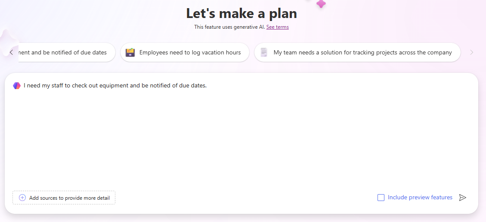
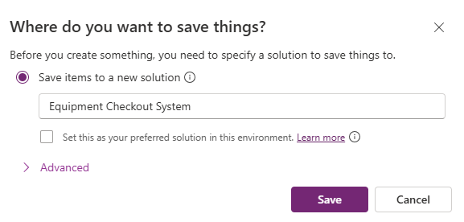

---
lab:
  title: 實驗室 1：使用計劃設計工具建立解決方案
  learning path: 'Learning Path: Describe the business value of Microsoft Power Platform'
  module: 'Module 2: Describe the business value of extending business solutions by using Microsoft Power Platform'
---

## 學習目標

在此練習中，學習者會使用計劃設計工具來建置完整的目標商務解決方案，其中包含應用程式、工作流程、代理程式等等。 Copilot 會引導您完成建立解決方案的整個程式。

完成此實驗室之後，您將：

- 使用計劃設計工具建置解決方案。
- 使用數據代理程式來建置數據模型。
- 使用解決方案代理程式來產生所需的不同元件。

### 案例

Contoso 諮詢是一個專業服務組織，專門從事 IT 和 AI 諮詢服務。 由於他們已切換到混合式工作模型，因此 Contoso 的許多員工都在家工作。 這會導致挑戰，因為他們的員工通常需要檢查設備。

Contoso 想要使用 Power Platform 來建置解決方案來管理簽入和取出設備。

在本練習中，您將使用 Microsoft Power Platform 中的方案設計工具，提供您嘗試解決之商務挑戰的描述，並使用建議來製作解決方案

> [!IMPORTANT]
> 此實驗室會使用 AI 來建置元件。 由於 AI 結果可能會有所不同，因此請務必注意，您的結果可能會與實驗室中定義的結果不同（但類似）。 實驗室中概述的基本概念將會是相同的，無論所建立的專案或所命名的內容為何。 如果建議/建立的物件與指示中所列的物件不符，您可能需要根據為您建立的對象進行調整。*

### 實驗時長

完成此練習 **的估計時間為 20 到 30** 分鐘。

## 工作 1：使用計劃設計工具建立方案方案

**使用計劃設計工具**

1. [開啟 Power Apps 製作者](https://make.powerapps.com)入口網站，並流覽至 **[首頁]** 畫面。
2. 在 [讓我們制定計劃 **] 底**下，輸入下列文字：「*我需要員工查看設備，並收到到期日通知」。*

3. 選取 [執行]**** 按鈕。
4. 方案設計工具會根據您提供的描述來產生計劃。 該計劃將包含下列專案：
    - 商務問題
    - 此計劃的目的
    - 使用者需求

需求 **代理程式** 會根據您提供的描述來建置使用者需求，而且應該視為方案的起點。 您可以視需要修改需求。

5. 若要變更需求，請選取 [ **編輯]** 按鈕。
6. 在 [**使用者需求 **] 標題下的 **[Copilot**] 字段中，輸入：「*員工應該能夠在設備取出*時回報是否有問題。
7. 選取 [執行]**** 按鈕。

新的問題報告需求將會新增至您的方案。

8. 列出需求后，請選取 [ **保留]** 按鈕。
9. 如果您滿意需求代理程式所產生的**需求，請選取 **[看起來不錯**]。**

接下來， **數據模型代理程式** 可協助您建立數據模型。 它會針對應建立哪些數據表來儲存解決方案的數據提出建議。

10.  若要檢視模型的詳細數據，請選取 [ **顯示詳細數據**]。

所有建議的數據表、數據行和關聯性都會顯示在數據模型設計工具中。 您可以使用 [Copilot] 窗格來變更數據模型。

11.  **在畫面右側的 [Copilot**] 窗格中，輸入下列內容：「*將文字數據行新增至設備數據表，稱為專案編號」。*
12.  將數據行新增至 **Equipment** 數據表之後，請使用 **Copilot** 個別輸入下列提示：
    - 「將新的文字數據行新增至名為Manager的 Staff/Employee 資料表。」
    - 「將新的選擇資料行新增至設備數據表，稱為設備類型」。
    - “將新的選擇數據行新增至設備數據表，稱為設備類型。 “

您的數據模型看起來應該像列出的模型。

> [!NOTE]
> > 這很可能不完全相符。 這沒關係。

13.  使用左側導覽，選取 [ **概觀** ] 圖示。 *（位於 [上一步箭號] 下方。*
14.  在 [數據代理程式] 中 **，選取 **[看起來不錯**] 以前進到下一**個步驟。

接下來， **解決方案代理程式** 會提供不同項目的建議。 在我們的案例中，建議代理程式建立兩個 Canvas 應用程式：A Power Automate 流程和代理程式。 *（你的可能不同）*

15.  在 [ **方案代理程式**] 中，選取 [ **編輯]** 按鈕。
16.  在 [Copilot **] 字段的 [** 技術] 標題下，輸入下列內容：「*建立專案結帳代理程式以回答員工問題」。*
17.  選取 [執行]**** 按鈕。
18.  **將會新增專案簽出代理程式**。 選取 [ **保留**]。
19.  如果您滿意解決方案代理程序的建議 **，請選取 **[看起來不錯**]。**
20.  選取 [ **儲存數據表** ] 以建置建議的數據模型。

計劃設計工具會為您建立的所有方案建置方案檔。 解決方案是應用程式生命週期管理 （ALM） 的重要元件。

21.  在 **[您要儲存 Thigs** 的位置] 畫面上，將解決方案的名稱設定為 [設備結帳系統]，然後選取 [ **儲存** ] 按鈕。

建立計劃設計工具建議的所有專案可能需要 1 到 3 分鐘的時間。 一旦訊息指出數據表已儲存，請選取 **X** 以關閉顯示訊息。

## 工作 2：建立和修改方案解決方案的應用程式

既然計劃設計工具已建立所有必要的數據表，併為要建立的物件提供建議，我們將建置建議的內容。 我們將從建置設備結帳應用程式開始。

1.  請確定您已 **開啟設備結帳系統** 方案。
2.  **在 [計劃概觀]** 窗格中仍會顯示，選取 [折迭] 按鈕，為您提供模式設計空間。 *（位於概觀窗格的右上方。*
3.  在 [ **設計** ] 視窗中，找出 **[設備簽出應用程式** ]，然後選取 [ **建立]** 按鈕。 *（Power Apps 將快速建置應用程式。*

建立您的應用程式之後，我們會對它進行一些基本修改。 在我們這樣做之前，讓我們來看看應用程式。

4.  選取 [ **歡迎使用] 畫面**。 *（提供快速存取保留、結帳和延伸模組等專案。*
5.  選取 [ **保留實體/結帳]** 畫面。 *（可讓您建立新的、檢視、編輯和刪除保留/結帳。）*
6.  流覽至其他畫面，例如**延伸模組要求**和**通知***（或我們為您的應用程式建立的畫面）。*
7.  選取 [ **歡迎使用] 畫面。**
8.  選取上 **圖 [保留實體/結帳]。**
9.  從出現的功能表中，選取 [**編輯****\>庫存**影像]。
10.  在 [ **搜尋]** 方塊中，輸入 **設備**。
11.  從清單中選取其中一個建議的影像，然後選取 [ **插入]** 按鈕。 *（***OPTIONAL：** *視需要重複剩餘影像）*
12.  選取 [ **保留實體/結帳] 文字下方的描述** 。
13. 在 **命令行**上，選取 [ **屬性]** 按鈕。 *（位於 [編輯] 按鈕右邊。*
14. 將 **Text** 屬性變更為：「啟動新的或檢視現有的保留專案」。
15. 選取 [ **保留實體/ 簽出** ] 文字，
16. 將 Text 屬性變更為「保留設備」。
17. 選取 **畫面頂端的歡迎畫面** 文字。
18. 將 **Text** 屬性變更為 「Contoso Equipment Checkout」。。
19. 在 [屬性] 窗格的 **[樣式和主題 **] 底下**，將填滿色彩變更為**深藍色**。** 選取 [員工 **] 上方**的影像。

**您的應用程式 [歡迎使用] 畫面**會類似顯示的影像：

您可以視需要進行其他變更，但現在我們將測試應用程式。

20.  在命令行上，選取 [ **播放** ] 圖示。 （*請注意，應用程式的版面配置會根據您的螢幕大小*而變更）
21.  選取 [ **保留設備** ] 映射。
22.  若要編輯記錄，請選取 [ **編輯]** 按鈕。
23.  **** 變更記錄的名稱。
24.  選取複 **選標記** 圖示以儲存您的變更。
25.  選取 [ **首頁]** 按鈕以返回 **歡迎畫面**。
26.  在應用程式的右上角，選取 **[紫色 X** ] 以返回設計工具。
27.  在 **命令列**上，選取 [ **儲存** ] 圖示以儲存您的應用程式。
28.  關閉瀏覽器索引**標籤以返回 **[設計規劃工具****]。 （*請注意，您的應用程式下的按鈕已從 create 變更為edit。*

> [[!NOTE]
> 如果您想要重複上述步驟，也可以建立和修改設備管理應用程式。

## 工作 3：建立建議流程

除了方案設計工具建議的應用程式之外，也可能會有建議的提醒通知流程。 接下來，我們將建立建議的流程。

1.  在 [ **設計** ] 視窗中，找出 **[提醒通知] 流程** ，然後選取 [ **建立]** 按鈕。 *（Power Automate 流程設計工具將會開啟）*
2.  系統會提供 **您建議的流程**，選取 [ **保留並繼續**]。
3.  在 [ **檢閱連線的應用程式和服務** ] 畫面上，確認所有連線都有綠色複選標記，然後選取 [ **建立流程** ] 按鈕。

建立的流程是一種週期性流程，將會每天執行、識別和簽出，且每個流程都會傳送電子郵件給簽出項目的人員。

4.  選取 [ **週期** ] 觸發程式。
5.  請注意，觸發程式已自動設定為 **間隔** **1** 和 **一天的頻率** 。 *（您也可以指定它也應該執行的特定一天時間。*

6.  選取 [ **列出數據列** ] 步驟。

此步驟將查看 **已建立為數據模型一部分的通知** 數據表，並識別具有 **DueDate** of **Today** 的任何記錄。

7.  如果 [資料表名稱 **] 欄位中有值**，請將其移除。
8.  在 [ **數據表名稱]** 字段中，輸入 **Notifications**，然後選取 **[cX\#X\#_notifications]** 或您環境中的類似名稱專案。

9.  **選取 [針對每個**步驟]。
10.  針對清單**數據列步驟中所**識別的每個記錄，流程會傳送電子郵件給已取出專案的員工電子郵件位址，以提醒他們專案將於今天回來。

    
> [!IMPORTANT]
> 請確定您的電子郵件步驟中有數據。 無法包含數據會導致錯誤。 如果遺漏數據，請填入步驟的欄位，以符合上圖。 如有需要，您可以在 [收件者] 字段中輸入自己的電子郵件位址。

您可以進行任何您看到符合流程的其他變更。 目前，我們將離開它， 因為它是。

11.  在 **命令行**上，選取 [ **儲存草稿** ] 按鈕。
12.  選取 [發佈] 按鈕。
13.  關閉 [ **瀏覽器] 索引** 標籤以返回 [ **計劃設計工具]** 索引標籤。
14.  請注意，**提醒通知流程**現在旁邊有編輯**** 圖示。

## 工作 4：建立專案簽出代理程式

最後，方案設計工具為專案簽出代理程式提供了建議，讓使用者可以利用該代理程式回答其保留相關問題等等。

1.  在 [ **設計** ] 視窗中，找出 **[項目簽出代理程式** ]，然後選取 [ **建立]** 按鈕。 *（科皮洛特工作室將開放）*

    Copilot Studio 會根據解決方案中的數據表，將知識新增至代理程式。 您可以視需要新增其他知識。 對於今天來說，我們將像現在一樣離開代理。

2.  在 [ **測試您的代理程式]** 窗格中，輸入下列內容：「 *Bob Johnson 是否有任何逾期專案已取出？*
3.  代理程式會根據數據表中的數據傳回回應。

4.  在 **Copilot Studio** 中，選取 [ **發佈]** 按鈕。
5.  在 [ **發佈此代理程式]** 畫面上，選取 [ **發佈]** 按鈕。
6.  關閉 [ **瀏覽器]** 索引標籤，以返回 [ **計劃設計工具**]。

## 工作 5：儲存方案

1.  在 [方案] 中，選取 [ **儲存** ] 按鈕以儲存它。
2.  儲存完成後，選取 **[上一步] 箭頭** 按鈕以返回 **Power Apps** 製作者入口網站。
3.  使用左側導覽，選取 [ **方案**]。
4.  請注意，您的 **設備結帳系統** 方案現在已列出。
5.  選取 **設備結帳系統** 方案，以在編輯器中開啟方案備份。
