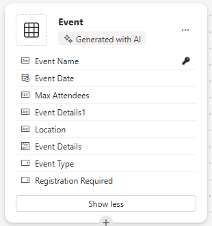
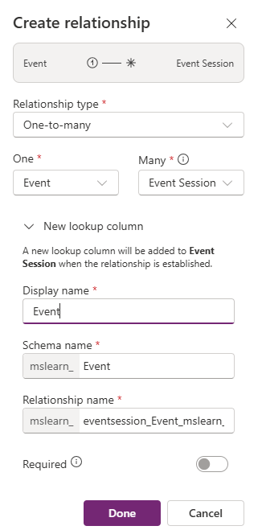
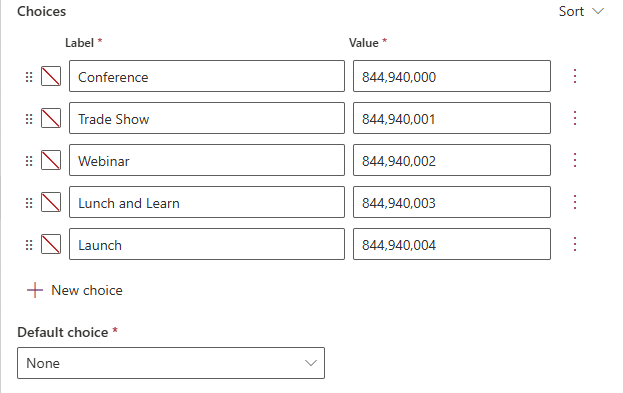

---
lab:
  title: 實驗室 2：建立資料模型
  learning path: 'Learning Path: Manage the Microsoft Power Platform environment'
  module: 'Module 1: Describe Microsoft Dataverse'
---

## 學習目標

在本練習中，學習者將使用 Copilot 來建置資料模型。 您將提供要建置的表格類型的描述，並使用設計工具視需要進行變更，例如新增其他資料行。

成功完成本實驗室後，您將：

- 使用 Copilot 協助您建立資料模型。
- 新增和編輯資料行至表格。

### 案例

Contoso Consulting 是一家專門從事 IT 和 AI 諮詢服務的專業服務組織。 全年，他們都會為客戶提供許多不同的活動。 其中一些是貿易展覽風格的活動，他們有許多合作夥伴進來並提供有關新產品、市場趨勢和服務的詳細信息。 其他活動全年舉辦，是快速網路研討會，用於提供有關個別產品的詳細資訊。

Contoso 想要使用 Power Platform 來建置事件管理解決方案，以管理他們全年舉辦的不同事件。 此外，Contoso 正在尋求建置一些應用程式來支援其員工設備檢查計劃。 

在本練習中，您將建立資料模式，用來儲存不同類型的事件、事件註冊，以及 Contoso 有效管理其事件所需的其他資料。 您還將創建一個設備表，該表將用於其其他應用程序。  

### 實驗室詳細資料

在開始此練習之前，建議您先完成：

- **實驗室 1 – 建立解決方案**

> **重要：** 本實驗室使用 AI 來建置元件。 由於 AI 結果可能會有所不同，因此請務必注意，您的結果可能與實驗室中定義的結果不同（但相似）。 實驗室中概述的基本概念將是相同的，無論創建了什麼或命名是什麼。 如果表格和欄不完全相符，您可能需要調整為為您建立的內容。

### 實驗時長

完成此練習的預計時間為 **30 至 45** 分鐘。

> **附註：** 在上一個實驗室中，我們建立了事件管理解決方案，並將其設定為此環境中的慣用解決方案。 因此，我們不需要直接前往解決方案來建立資料模型。 我們建立的項目將自動新增至解決方案。

## 作業 1：建立資料模型

Contoso 目前將捐贈者連絡資訊儲存在其 Dataverse 執行個體中。 他們想要使用 Dataverse 來追蹤他們正在申請的補助金和他們收到的捐款。 您必須建立必要的數據表，以支援 Contoso 未來的應用程式需求。

1.  如有必要，請開啟網頁瀏覽器並導覽至 [Power Apps](https://make.powerapps.com/) 製作者入口網站，然後使用您的 Microsoft 帳戶認證登入。
1.  在 Power Pages 主畫面上，使用左側的導覽，選取**資料表。**
1.  在資料表下****，選取開始**使用 Copilot**。
1.  在描述您希望副手建立**的資料表畫面中**，輸入：「*建立用於管理事件的資料表。該表應標明活動名稱、活動數據、地點、最大出席人數和活動詳細信息。*
1.  在 產生 **** 按鈕旁邊，選取 **表格設定**，然後設定如下：
    - **表格選項：** 一張桌子
    - **** 不要包括關係。

    

1.  選取 產生** 按鈕**。

    > **重要：** Copilot 應該只建立**一個**名為 [事件]** 的資料**表。 如果已建立 **更多，您必須告訴 Copilot 要刪除的資料表名稱，以刪除** 它們。 **如果無法移除任何額外的資料表，將會影響下一個步驟。**

    ![Copilot 所建立的 [事件] 資料表的螢幕擷取畫面。](media/event-checkpoint.png)

**使用 Copilot 編輯資料模型**

現在我們已經創建了表格，我們將向其中添加一些額外的列。 我們將首先添加一個事件類型列。 此外，聯絡人將參加我們的活動。 我們想要將現有的 Contact 資料表新增至資料模型，並稍後將其與事件註冊相關聯。

7.  在 [您接下來要做什麼？] **** 欄位中，輸入：*`Add a choice column named Event Type to Event table.`*
1.  輸入下列文字來新增另一欄： *`Add a choice column named Registration Required to Event table.`*

    

    > **重要事項：** 您的事件表格不必與上圖完全相符，但至少應包含下列欄：
    - 事件名稱
    - 事件日期
    - 出席人數上限
    - Location
    - 事件類型
    - 需要註冊。

    如果您沒有上述所有資料行，請使用 Copilot 將它們新增至資料模型。  

    接下來，讓我們將 Contact** 資料表新增至**資料模型。

1.  在頂端的命令列**中**，選取 **+ 現有資料表。**
1.  在 Search （搜尋 **） **欄位中，輸入 **Contact**，然後選擇 **Add Selected （新增選取的）。**

    視事件類型而定，可能會有一或多個工作階段。 為了管理不同的會話，我們需要定義會話是什麼以及與之關聯的事件。 接下來，我們將使用 Copilot 建立事件會話表。

1.  在 [您接下來要做什麼？] **** 欄位中，輸入：*`Add a new table called Event Session. `*

    Copilot 可能會建立兩個資料表：活動會話和活動演講者。 由於我們的聯絡人將是演講者，因此我們將移除活動演講者表格。

1.  如有必要，請在 您接下來要做什麼？**** 欄位中，輸入：*`Remove the Event Speaker table.`*
1.  在 Copilot 中，輸入下列文字： *`Add a new text column to the Event Session table called Session Description.`*

    

    接下來，我們將新增最後一個名為 Session Registrations** 的**表格。 此表格將用於管理註冊特定會議的個人。

1.  在 Copilot 中，輸入下列文字： *`Add a new table called Session Registrations.`*

    Copilot 可能會建立兩個資料表：會話註冊、會話或參與者 （或其他資料）。 由於我們的聯絡人可以是參與者，因此我們將移除參與者表格。 如果已建立 Session Registration 以外的任何其他資料表 （例如工作階段或其他資料），請移除它們。

1.  如有必要，請在 Copilot 中輸入下列文字： *`Remove the Participant table.`*
    
    有時，參與者名稱欄會新增至工作階段註冊表。 我們需要刪除它，因為它可能會在稍後嘗試保存數據模型時引起問題。 （我們稍後將用不同的參與者欄替換它。  

1.  如有必要，請在 Copilot 中輸入下列文字： *`Remove the Participant Name column from the Session Registration table.`*

1.  如果您現在有「主要欄」欄位，請輸入下列文字： *`Rename the Primary Column to Registration Name in Session Registration table.`*

1.  在 Copilot 中，輸入下列文字： *`Add a text column to the Session registration table called Special Instructions.`*

    您完成的「工作階段註冊」表格應如下圖所示：

    

    > **重要事項** 雖然您的資料不需要完全相符，但重要的是您沒有名為「參與者」的資料行，而且您至少具有下列項目：
    - 註冊名稱
    - 會議日期
    - 特別說明

    現在我們將在不同的表之間建立關係。 由於連絡人記錄可以是工作階段中的發言者，因此我們將在「連絡人」和「事件工作階段」資料表之間建立關係。

1.  在命令列上，選取**建立關聯性。**
1.  設定關係，如下所示：
    - **關係類型：** 一對多
    - **一：** 聯繫方式
    - **許多：** 活動會議
    - **顯示名稱 **`Speaker`
1.  選取**完成**。

    

    由於聯絡人可以在工作階段中註冊工作階段，因此我們將在聯絡人和工作階段註冊資料表之間建立關係。

1.  在命令列**上**，選取**建立關聯性。**
1.  設定關係，如下所示：
    - **關係類型：** 一對多
    - **一：** 聯繫方式
    - **多：** 會話報名
    - **顯示名稱 **`Participant`

    

1.  選取**完成**。

    單一事件可以有多個與其相關聯的工作階段，因此我們將在事件和事件工作階段資料表之間建立關係。

1.  在命令列**上**，選取**建立關聯性。**
1.  設定關係，如下所示：
    - **關係類型：** 一對多
    - **一：** 活動
    - **許多：** 活動會議
    - **顯示名稱 **`Event`

    

1. 選取**完成**。

    最後，參與者註冊事件工作階段，因此我們需要在事件工作階段和工作階段註冊表之間建立關聯性。

1.  在命令列**上**，選取**建立關聯性。**
1.  設定關係，如下所示：
    - **關係類型：** 一對多
    - **一：** 活動環節
    - **許多：** 工作階段註冊
    - **顯示名稱 **`Event Session`

    

1.  選取**完成**。

    您新建立的資料模型應類似於影像：

    

1.  選取 [ **儲存並結束]。**

## 作業 2：直接編輯表格和欄

Copilot 是快速建立表格和資料行的絕佳方式。 但是，有時您可能需要直接對表格和列進行修改。 例如，在此工作中，我們將更新一些現有欄，並追蹤特定工作階段註冊的參與者人數。

1.  如有必要，請開啟網頁瀏覽器並導覽至 [Power Apps](https://make.powerapps.com/) 製作者入口網站，然後使用您的 Microsoft 帳戶認證登入。
1.  使用左側的巡覽功能，選取 [資料表]****。
1.  在 搜尋** 欄位**中，輸入 **事件**。
1.  開啟事件**表格**。
1.  在 結構描述** 標題**下，選取 **資料行。**
1.  找到並開啟 事件型別** 欄**。
1.  將標籤取代為下列項目：
    - 會議
    - 商展
    - 網路研討會
    - 午餐和學習
    - 啟動
1.  將預設 **選項** 設定為 **無**。

    

1.  選取 [儲存]**** 按鈕。 （*如果欄無法儲存，請第一次重試。*

    接下來，我們將在「事件工作階段」**** 表格中新增一欄，以追蹤工作階段註冊總數。

1.  使用左側的導覽，選取 **[表格]** 以離開 [事件 **] **表格。
1.  在 搜尋** 欄位**中，輸入 **事件**。
1.  開啟「事件工作階段」**** 表格。
1.  在 結構**描述** 標題下，選取 **欄。**
1.  在命令列上，選取新增資料行**按鈕**。
1.  設定新資料行，如下所示：
    - **顯示名稱 **`Total Registrations`
    - **資料類型：** 整數
    - **行為**：Rollup

    

1.  選取 [ **儲存並編輯**]。

    > **重要事項：** 如果您已開啟彈出式視窗封鎖工具，可能需要將其關閉，才能顯示總覽欄位。

1.  設定彙總欄，如下所示：
    - 在相關實體下 **，選取**新增相關實體**。**
    - 選擇 Session Registration （ **工作階段註冊** ） 表格。
    - 選取 [儲存變更] **按鈕 （*核取記號*）**
    - 在 [彙總] 底下 **，選取 [**新增彙總**]。**
    - 在 Aggregate Function （彙總函數） 下 **，選擇 **Count （計數**）。**
    - 針對 **彙總相關實體欄位**，選取 **工作階段註冊**。
    - 選取 [儲存變更 **] **按鈕 *（核取記號）*

    

1.  選取**儲存後關閉**按鈕。

    您現在已成功建立將用來支援事件管理應用程式的資料模型。 

## 作業 3：建立設備表格

除了管理事件之外，Contoso 還有員工結帳計劃。  接下來，我們將建立表格來儲存設備。 
1.  使用左側的巡覽功能，選取 [資料表]****。
1.  在資料表下****，選取開始**使用 Copilot。**
1.  在描述您希望 Copilot 建置**的資料表畫面**中，輸入：*`Create a table for checking out equipment. The table should include the Equipment Name, Due Date, and Item number.`*
1.  在 產生 **** 按鈕旁邊，選取 **表格設定**，然後設定如下：
    - **表格選項：** 一張桌子
    - **** 不要包括關係。

    

1. 選取 產生** 按鈕**。

    > **重要：** Copilot 應該只建立一個名為 [結帳設備]** 的資料**表。 如果已建立更多，您可以透過告訴 Copilot 要刪除的資料表名稱來刪除它們。

**使用 Copilot 編輯資料模型**

現在我們已經創建了表格，我們將向其中添加一些額外的列。 我們將首先添加一個事件類型列。 此外，聯絡人將參加我們的活動。 我們想要將現有的 Contact 資料表新增至資料模型，並稍後將其與事件註冊相關聯。

6.  在 [您接下來要做什麼？] **** 欄位中，輸入：*`Rename the table to Equipment.`*
1.  在 [您接下來要做什麼？] **** 欄位中，輸入：*`Add a choice column named Equipment type.`*
1.  輸入下列文字來新增另一欄： *`Add a text column named Category.`*
1.  輸入下列文字來新增另一欄： *`Add a text column named Status.`*

    您完成的表格應如下圖所示：

    

1.  如果您的表格包含額外的欄，請輸入 *`Delete the [column name] column.`*
1.  一旦您的表格與影像相符，請選取 [ **儲存並結束**]。

## 作業 4：直接修改「設備」表格

1.  如有必要，請開啟網頁瀏覽器並導覽至 Power Apps 製作者入口網站，然後使用您的 Microsoft 帳戶認證登入。
1.  使用左側的巡覽功能，選取 [資料表]****。
1.  在搜尋**欄位**中，輸入**設備。**
1.  開啟 [設備] **** 表格。
1.  在 結構描述** 標題**下，選取 **資料行。**
1.  找到並開啟「設備類型 **」** 欄。
1.  如有必要，請將標籤替換為以下內容：
    - 電子
    - 傢俱
    - 工具
    - Accessories
1.  將預設 **選項** 設定為 **無。**

    

1.  選取 [儲存] 按鈕。 （如果資料行無法儲存，請第一次重試。

恭喜您，您已成功在 Microsoft Dataverse 中建立資料模型。

