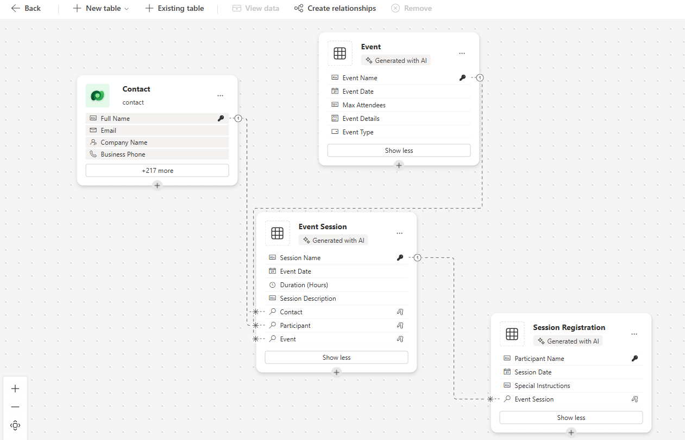

---
lab:
  title: 實驗室 2：建立數據模型
  learning path: 'Learning Path: Manage the Microsoft Power Platform environment'
  module: 'Module 1: Describe Microsoft Dataverse'
---

## 學習目標

在本練習中，學習者將會使用 Copilot 來建置數據模型。 您將提供您想要建置的數據表類型描述，並使用設計工具視需要進行變更，例如新增其他數據行。

完成此實驗室之後，您將：

- 使用 Copilot 協助您建立數據模型。
- 在數據表中新增和編輯數據行。

### 案例

Contoso 諮詢是一個專業服務組織，專門從事 IT 和 AI 諮詢服務。 全年，他們為客戶提供許多不同的活動。 其中一些是貿易展示風格活動，他們有許多合作夥伴進來，並提供新產品、市場趨勢和服務的詳細數據。 其他則發生在全年，並且是快速網路研討會，用來提供個別產品的詳細數據。

Contoso 想要使用 Power Platform 來建置事件管理解決方案，可用來管理他們全年裝載的不同事件。

在本練習中，您將建立數據模式，以用來儲存 Contoso 所需的不同事件類型、事件註冊和其他數據，以有效管理其事件。

### 實驗室詳細數據

開始此練習之前，建議您先完成：

- **實驗室 2 – 建立 Power Platform 解決方案**

> [!IMPORTANT]
> 此實驗室會使用 AI 來建置元件。 由於 AI 結果可能會有所不同，因此請務必注意，您的結果可能會與實驗室中定義的結果不同（但類似）。 實驗室中概述的基本概念將會是相同的，無論所建立的專案或所命名的內容為何。 如果數據表和數據行不完全相符，您可能需要調整為您建立的專案。

### 實驗時長

完成此練習 **的估計時間為 20 到 30** 分鐘。

> [!NOTE]
> 在上一個實驗室中，我們建立了事件管理解決方案，並將它設定為此環境中的慣用解決方案。 因此，我們不需要直接前往解決方案來建立數據模型。 我們建立的項目會自動新增至方案。

## 工作 1：建立數據模型

Contoso 目前會將聯繫人資訊儲存在其 Dataverse 實例中。 他們想要使用 Dataverse 來追蹤他們申請的贈款，以及他們正在接收的捐款。 您必須建立必要的資料表，以支援 Contoso 未來的應用程式需求。

1.  如有必要，請開啟網頁瀏覽器並流覽至 [Power Apps](https://make.powerapps.com/) 製作者入口網站，然後使用您的Microsoft帳戶認證登入。
2.  使用左側的巡覽功能，選取 [資料表]****。
3.  在 [數據表] 底**下，選取 **[開始使用 Copilot**]。**
4.  在 [ **描述您想要員警建置** 的數據表] 畫面中，輸入：「*建立數據表來管理事件。數據表應識別事件名稱、事件數據、出席者數目上限，以及事件詳細數據。」*
5.  在 [ **產生]** 按鈕旁，選取 **[數據表設定**]，然後設定如下：
    - **數據表選項：** 一個數據表
    - 請勿**** 包含關聯性。

6.  選取 [ **產生]** 按鈕。

> [!IMPORTANT]
> Copilot 應該只建立一個名為 Events 的數據表。 如果已建立更多，您可以藉由告訴 Copilot 資料表的名稱來刪除它們。

**使用 Copilot 編輯數據模型**

既然我們已建立數據表，我們將新增一些額外的數據行。 我們將從新增事件類型數據行開始。 此外，聯繫人將出席我們的活動。 我們想要將現有的 Contact 數據表新增至數據模型，並在稍後將它與事件註冊產生關聯。

1.  在 **[您要執行的下一**步 t] 字段中，輸入：「*新增名為事件類型的選擇數據行」*
2.  輸入下列文字以新增另一個數據行：“*新增名為 registration required* 的選項數據行”

接下來，讓我們將 **Contact** 數據表新增至數據模型。

3.  在頂端的 **命令行** 中，選取 **[+ 現有數據表]。**
4.  在 [ **搜尋]** 字段中，輸入 **[聯繫人**]，然後選擇 [ **新增選取**]。

視事件類型而定，可能會有一或多個會話。 若要管理不同的會話，我們需要定義會話是什麼，以及與其相關聯的事件。 接下來，我們將使用 Copilot 建立事件會話數據表。

5.  **在 [您要執行下一個**動作] 字段中，輸入：「*新增名為事件會話的新數據表」。*

Copilot 可能會建立兩個數據表：事件會話和事件演講者。 由於我們的聯繫人將會是演講者，因此我們將移除事件演講者數據表。

6.  如有必要，請在 **[您要執行下一個** 動作] 字段中，輸入：「*移除事件演講者數據表」。*
7.  在 Copilot 中，輸入下列文字：「*將新的文字數據行新增至名為會話描述的事件會話數據表」。*

接下來，我們將新增一個名為會話註冊的最後一個數據表，此數據表將用來管理註冊特定會話的人員。

8.  在 Copilot 中，輸入下列文字：「 *新增名為會話註冊的新數據表」。*

    Copilot 可能會建立兩個數據表：會話註冊、會話或參與者。 由於我們的聯繫人可以是參與者，因此我們將移除參與者數據表。 如果已建立會話註冊以外的任何其他數據表（例如會話），請將其移除。

9.  在 Copilot 中，輸入下列文字：「*移除參與者數據表」。*
10.  在 Copilot 中，輸入下列文字：「*將文字數據行新增至稱為特殊指示的會話註冊數據表」。*

現在，我們將在不同的數據表之間建立關聯性。 由於聯繫人記錄可以是會話中的演講者，因此我們將建立聯繫人與事件會話數據表之間的關聯性。

11.  在命令行上，選取 [ **建立關聯性**]。
12.  設定關聯性，如下所示：
    - **關聯性類型：** 一對多
    - **一：** 連絡人
    - **許多：** 事件會話
    - **顯示名稱：** 說話者
13.  選取**完成**。

由於聯繫人可以在會話中註冊會話，因此我們將建立 [聯繫人] 和 [會話註冊] 數據表之間的關聯性。

14.  在命令行上 **，選取 [**建立關聯性**]。**
15.  設定關聯性，如下所示：
    - **關聯性類型：** 一對多
    - **一：** 連絡人
    - **許多：** 工作階段註冊
    - **顯示名稱：** 參與者

16.  選取**完成**。

單一事件可以有多個相關聯的會話，因此我們將建立事件與事件會話數據表之間的關聯性。

17.  在命令行上 **，選取 [**建立關聯性**]。**
18.  設定關聯性，如下所示：
    - **關聯性類型：** 一對多
    - **一：** 事件
    - **許多：** 事件會話
    - **顯示名稱：** 事件

最後，參與者註冊事件會話，因此我們必須建立事件會話與會話註冊數據表之間的關聯性。

19.  在命令行上 **，選取 [**建立關聯性**]。**
20.  設定關聯性，如下所示：
    - **關聯性類型：** 一對多
    - **一：** 事件會話
    - **許多：** 工作階段註冊
    - **顯示名稱：** 事件會話

21.  選取**完成**。

您新建立的資料模型應該類似映像：

22.  選取 [ **儲存並結束]。**

## 工作 2：直接編輯數據表和數據行

Copilot 是非常快速地建立數據表和數據行的絕佳方式。 不過，有時候您可能需要直接修改數據表和數據行。 例如，在此工作中，我們將更新一些現有的數據行，並追蹤已針對特定會話註冊多少參與者。

1.  如有必要，請開啟網頁瀏覽器並流覽至 [Power Apps](https://make.powerapps.com/) 製作者入口網站，然後使用您的Microsoft帳戶認證登入。
2.  使用左側的巡覽功能，選取 [資料表]****。
3.  在 [ **搜尋]** 欄位中，輸入 **[事件**]。
4.  **開啟 [事件**] 數據表。
5.  在 [ **架構]** 標題底下，選取 [ **數據行**]。
6.  找出並開啟 [ **事件類型** ] 資料行。
7.  將標籤取代為下列專案：
    - 會議
    - 網路研討會
    - 午餐和學習
    - 啟動
8.  將 [ **預設選項** ] 設定為 [ **無**]。

9.  選取 [儲存]**** 按鈕。 （*如果數據行無法儲存，第一次再試一次。*

接下來，我們會將新的數據行新增至 **事件會話** 數據表，以追蹤會話註冊的總數。

10.  使用左側的巡覽功能，選取 [資料表]****。
11.  在 [ **搜尋]** 欄位中，輸入 **[事件**]。
12.  開啟 [ **事件會話]** 數據表。
13.  在 [ **架構]** 標題底下，選取 [ **數據行**]。
14.  在命令行上，選取 [ **新增數據行** ] 按鈕。
15.  設定新的資料行，如下所示：
    - **顯示名稱：** 註冊總數
    - **數據類型：** 整數
    - **行為**：匯總

![[註冊總數] 數據行的螢幕快照。](media/3e0921e5b887c7b68fe406d750b5f7d2.png)

16.  選取 [ **儲存並編輯**]。

> [!IMPORTANT]
> 如果您已開啟快顯封鎖程式，您可能需要關閉快顯封鎖程式，才能顯示匯總字段。

17.  設定匯總數據行，如下所示：
    - 在 [相關實體] 底下 **，選取 [**新增相關實體**]。**
    - 選擇 [ **工作階段註冊** ] 資料表。
    - 選取 [儲存 **變更** ] 按鈕 （*複選標記*）
    - 在 [匯總] 底下 **，選取 [**新增匯總**]。**
    - 在 [聚合函數 **] 下**，選擇 [**計數**]。
    - 針對 **[匯總相關實體]** 字段，選取 [ **會話註冊**]。
    - 選取 [儲存 **變更** ] 按鈕 *（複選標記）*

![[註冊總計匯總] 字段設定的螢幕快照。](media/54857f151ec4bd67bb1a1578c02b726a.png)

18.  選取**儲存後關閉**按鈕。

您現在已成功使用 Copilot 在 dataverse 中Microsoft建立數據表和數據行。
