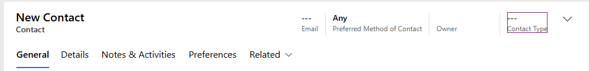
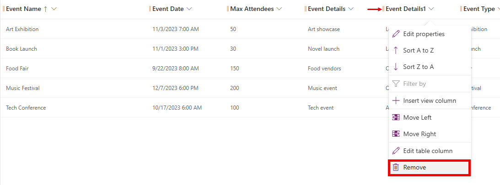
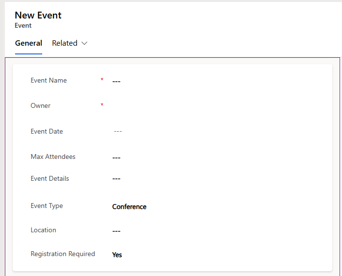

---
lab:
  title: 實驗室 4：建立模型驅動應用程式
  learning path: 'Learning Path: Demonstrate the capabilities of Microsoft Power Apps'
  module: 'Module 3: Build a model-driven app'
---
## 學習目標

在本練習中，學習者將會使用 Copilot 在 Power Apps 中建立模型驅動應用程式。 您將定義數據模型、修改表單和檢視，以及建立應用程式。

**完成此實驗室之後，您將：**

-   建置模型驅動應用程式。
-   修改應用程式中的表單和檢視，以最符合您的需求。
-   流覽模型驅動應用程式。

### 案例

Contoso 諮詢是一個專業服務組織，專門從事 IT 和 AI 諮詢服務。 全年，他們為客戶提供許多不同的活動。 其中一些是貿易展示風格活動，他們有許多合作夥伴進來，並提供新產品、市場趨勢和服務的詳細數據。 其他則發生在全年，並且是快速網路研討會，用來提供個別產品的詳細數據。

Contoso 想要使用 Power Platform 來建置事件管理解決方案，可用來管理他們全年裝載的不同事件。

在本練習中，您將建置模型驅動應用程式來管理 Contoso 的事件。 模型驅動應用程式會以現有的數據模型為基礎，並將包含事件、事件會話和會話註冊。

### 實驗室詳細數據：

開始此練習之前，建議您先完成：

-   **實驗室 1 – 建立解決方案**
-   **實驗室 2 – 建立數據模型**

完成此練習 **的估計時間為 20 到 30** 分鐘。

## 工作 1：建立數據模型以支援新的模型驅動應用程式

Contoso 目前會將聯繫人資訊儲存在其 Dataverse 實例中，因此他們想要使用 Dataverse 來追蹤課程和課程註冊。 您必須建立必要的數據表，以支援應用程式，並根據該數據模型建置模型驅動應用程式。

1.  如有必要，請開啟網頁瀏覽器並流覽至 [Power Apps](https://make.powerapps.com/) 製造商入口網站，然後使用您的Microsoft帳戶認證登入。
1.  使用左側導覽，選取 [ **解決方案]。**
1.  **開啟您稍早建立的事件管理解決方案**。
1.  在命令行上，選取 **[新增****\>應用程式\>****模型驅動應用程式]。******
1.  選取 [ **建立]** 區段。
    -   **名稱**：`Contoso Event Management`
    -   **描述：**` Used to manage Events and Event Sessions`。
1.  選取 [建立]**** 按鈕。
1.  選取 [ **+新增頁面]** 按鈕，選取 **[Dataverse 數據表]。**
1.  選取下列資料表：
    -   連絡人​​
    -   事件
    -   事件工作階段
    -   會話註冊
1.  確定已選取 [ **在導覽** 中顯示]。

    ![顯示 [選取數據表] 對話框的螢幕快照。](media/bb46dc856d2939af9c55bdc0303b8a27.png)

1. 選取 [新增]**** 按鈕。

> **注意：** 有時候您會在使用設計工具時收到登入的提示。 選取要取消登入畫面的 X。

## 工作 2：編輯模型驅動應用程式以符合您的需求

現在已建立應用程式，我們將對應用程式呈現的方式進行一些變更。 我們想要有兩個不同的群組：人員和事件。 我們想要在 [人員] 群組中擁有 [聯繫人] 數據表，以及 [事件] 群組中的所有 [事件] 數據表。

1.  在 **畫面左側的 [流覽** ] 底下，選取 [ **新增群組**]。
1.  在應用程式的右側，展開 [ **屬性** ] 面板。
1.  將 [標題 **] 從 **[** 新增群組**] 變更為 `People`。

    

1.  選取 [**人員]** 群組上的**省略號**。
1.  選擇 [ **新增群組**]。
1.  在 [ **屬性]** 窗格中，將群組的名稱從 **[新增群組** ] 變更為 `Events`。
1.  **將滑鼠停留在左側的 [會話註冊] 檢視**上，選取**省略號**，然後選擇 **[下**移] 將 [會話註冊****] 移至 **[事件**] 群組。
1.  將滑鼠停留在左側的事件**會話檢視上，選取**省略號**，然後選擇 **[下**移] 將 [事件會話****] 移至 **[事件**] **群組。
1.  **將滑鼠停留在左側的 [事件] 檢視**上，選取**省略號**，然後選擇 **[下**移] 將 [事件] 移至 **[事件****] 群組**。

    您的應用程式應該與映像類似：

    

## 工作 3：編輯模型驅動應用程式中的不同表單和檢視

模型驅動應用程式會使用表單和檢視，在使用者介面 （UI） 中向使用者呈現數據。 我們將對這些項目進行一些變更。

1.  如有必要，請確定您的 **Contoso 事件管理** 應用程式已在設計工具中開啟。
1.  在畫面左側的 [人員 **] 群組底下**，將滑鼠停留在 [聯繫人] 表單**上**，然後選取 [**編輯]。**

    如果系統提示您儲存變更，請選取 [ **儲存並繼續]。**

1.  在 **左側的 [數據表數據** 行] 下，選取 [ **新增數據表數據行**]。
1.  設定資料表數據列，如下所示：
    -   **顯示名稱 **`Contact Type`
    -   **數據類型：** 選擇
    -   **與全域選擇同步：** 否
1.  將第一個選項的 [ **卷標** ] 設定為 **[演講者]。**
1.  選取 **[+ 新增選擇** ]，並將標籤設定為 **[參與者]。**
1.  選取 **[+ 新增選擇** ]，並將標籤設定為 **[支持人員**]。

    ![[連絡人類型] 資料行的螢幕快照。](media/b1982b779d91cf134b41b6f445b8f07c.png)

1.  選取 [儲存]**** 按鈕。
1.  使用滑鼠，選取 [ **新增聯繫人** ] 文字以選取窗體標頭。 *（標頭周圍應該會出現紫色矩形）*
1. 在 **[數據表數據行**] 下的 **[搜尋** ] 欄位中，輸入 **[聯繫人**]。
1. 選取您剛才建立的 [ **聯繫人類型** ] 資料表數據行。
1. 聯繫人**類型**現在應該會出現在標頭**中**。

    

1. 在表單 **命令行**上，選取 [ **儲存併發佈]** 按鈕。
1. 選取 [ **上一步] 箭頭** 按鈕以返回模型驅動應用程式設計工具
1. **在**左側流覽下方，將滑鼠停留在 [聯繫人] 檢視**上**，然後選取 [**編輯**] 圖示。 （如果系統提示您儲存，請選取 **儲存後繼續。**）
1. 選取 **[+ 檢視數據行**]。
1. 搜尋並新增 **[聯繫人類型** ] 資料行至檢視。
1. 選取 [ **儲存併發佈]** 按鈕。
1. 選取 [ **上一步] 箭頭** 按鈕以返回模型驅動應用程式設計工具。

    接下來，我們將對其餘窗體進行必要的變更。

1.  在 [流覽 **] 底下**，選取 [**事件檢視]**
    
    請注意，可能有 **EventDetails1 數據** 行。 如果是，我們會從檢視中移除它。 *（如果您沒有它，可以跳到 **工作 4：儲存和發佈**）*

1.  將滑鼠停留在 [ **事件] 檢視** 上，然後選取 [ **編輯]** 按鈕。

    如果系統提示您儲存**** 變更，請選取 [**儲存並繼續**]。

1.  在 [**檢視]** 上，選取 EventDetails1** 旁**的箭號，然後從出現的功能表中選取 [**移除**]。

    

1.  選取 [ **儲存併發佈]** 按鈕。
1.  選取 [ **上一步] 箭頭** 按鈕以返回應用程式設計工具。
1.  在 [導覽] 底**下，將滑鼠停留在 **[事件****] 窗體**上，然後選取 [**編輯**]。**

    如果系統提示您儲存變更，請選取 [ **儲存並繼續**]。

1.  選取 **[事件詳細數據1]** 字段，然後按 **鍵盤上的 [刪除** ] 鍵。

    您的表單應該類似影像：

    

    如果它不完全相符，只要圖片中的所有欄位都在那裡，就沒問題。  

1.  選取 [ **儲存併發佈]** 按鈕。
1.  選取 [ **上一步] 箭頭** 按鈕以返回應用程式設計工具。

## 工作 4：儲存和發佈 （如果您窗體上沒有 EventDetail1 字段，請在這裡繼續。

1.  在 **應用程式的命令行** 上，選取 [ **儲存併發佈]** 按鈕。

1.  選取 [ **上一頁** ] 按鈕以返回 **事件管理解決方案** 。
1.  選取 **[回到解決方案]** 箭號，返回主要 **Power Apps** 製作者入口網站。
1.  選取 [ **上一步** ] 箭號以返回主要 **Power Apps** 畫面。

## 工作 5：測試新的應用程式

現在已建立模型驅動應用程式，我們將測試其功能。

首先，我們將新增幾個聯繫人。

1.  使用左側的導覽，選取 [應用程式]。
1.  將顯示的應用程式從 **[我的應用程式** ] 變更為 **[全部**]。
1.  將滑鼠停留在您剛才建立的 **Contoso 事件管理** 應用程式上，然後選取 **[播放** ] 圖示。
1.  使用左側導覽，選取 [ **聯繫人**]。
1.  在 **命令行** 上，選取 [ **+ 新增** ] 按鈕。
1.  在 [ **新增聯繫人]** 畫面中，設定如下：
    -   **名字：** `Suzanne`
    -   **姓：** `Diaz`
    -   **職稱：** `Engineer`
1.  在窗體標頭中，選取 [聯繫人類型] 旁的 **向下箭號**。
1.  將 [ **聯繫人類型** ] 設定為 **[說話者**]。

    ![顯示如何在表單上設定 [聯繫人類型] 欄位的螢幕快照。](media/0860116a9b7df096c14728212b9977b1.png)

1.  選取 [ **儲存** ] 按鈕以儲存聯繫人，並將它保持開啟。
1. 選取 [**+ 新增**] 按鈕。
1. 在 [ **新增聯繫人]** 畫面中，設定如下：
    -   **名字：** 埃德加
    -   **姓氏：** 斯文森
    -   **職稱：** 架構師
    -   **電子郵件：** 輸入您的電子郵件地址（請確定您新增 **電子郵件位址** 。）
1. 在窗體標頭中，選取 [聯繫人類型] 旁的 **向下箭號**。
1. 將 [ **聯繫人類型** ] 設定為 **[參與者**]。
1. 選取 [儲存和關閉] **** 按鈕。

    接下來，我們將新增事件。

1.  使用左側導覽，選取 **[事件**]。
1.  在命令行上，選取 [ **+ 新增** ] 按鈕。
1.  在 [ **新增事件** ] 畫面中，設定如下：
    - **事件名稱：**`Spring conference`。
    - **事件日期：** 明天的日期。
    - **最大出席者：** `500`
    - **事件詳細數據：**`Spring conference to showcase newest products and services from our supported vendors`。
    - **事件類型：** 會議
    - **位置**：`Seattle`
    - **註冊必要：** 是/True

    

1.  選取 [儲存和關閉] **** 按鈕。

    接下來，我們將新增事件的新會話。

1.  使用左側導覽，選取 **[事件會話**]。
1.  選取 [**+ 新增**] 按鈕。
1.  設定 **事件會話** ，如下所示：
    - **會話名稱：** `Responsible AI`
    - **會話日期：** 明天的日期
    - **持續時間：** 1.5 小時
    - **會話描述：**`With all the new AI solutions, being responsible is important. We will discuss the challenges`。
    - **議長：** `Suzanne Diaz`
    - **事件：** `Spring Conference`

    

1.  選取**儲存後關閉**按鈕。

    最後，我們將建立 **會話註冊**。

1.  使用左側導覽，選取 [ **會話註冊]。**
1.  在命令行上 **，選取 **[+ 新增**]。**
1.  完成工作階段註冊，如下所示：
    - **註冊名稱：**`E, Swenson Registration`。
    - **擁有者：** 保留為
    - **註冊日期：** 今日日期
    - **特殊指示：** `No Gluten`
    - **參與者：** `Edgar Swenson`
    - **事件會話：** `Responsible AI`

    

1.  選取 [儲存後關閉]**** 按鈕。

