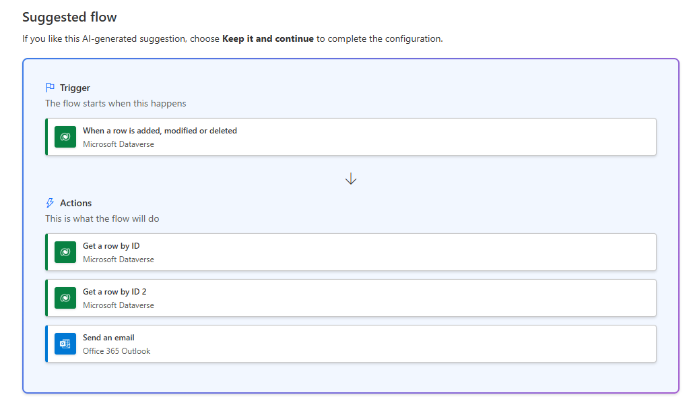
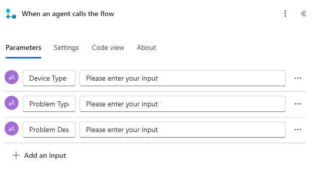

---
lab:
  title: 實驗室 6：建立 Power Automate 流程
  learning path: 'Learning Path: Demonstrate the capabilities of Microsoft Power Automate'
  module: 'Module 2: Build a Microsoft Power Automate flow'
---
## 學習目標

在本練習中，學習者會使用Power Automate中的 Microsoft Copilot 來建立一系列不同的雲端流程。 您將使用不同的建立方法，例如 Copilot 和從頭開始熟悉可用的不同選項。

**完成此練習之後，您將：**

- 使用自然語言提示來設計工作流程
- 設定觸發程式和動作
- 測試自動化以實際使用。

### 案例

Contoso 諮詢是一個專業服務組織，專門從事 IT 和 AI 諮詢服務。 全年，他們為客戶提供許多不同的活動。 其中一些是貿易展示風格活動，他們有許多合作夥伴進來，並提供新產品、市場趨勢和服務的詳細數據。 其他則發生在全年，並且是快速網路研討會，用來提供個別產品的詳細數據。 此外，Contoso 開始使用自動化代理程式來協助客戶解決問題。

Contoso 想要使用 Power Automate 建置註冊確認流程，以在客戶註冊事件時傳送自動電子郵件給客戶。 此外，他們想要建立流程，以使用 AI 來提供客戶問題的產生式解答。

在本練習中，您將根據特定準則建置一系列 Power Automate 流程。

開始本練習之前，您必須先完成下列實驗室：

- **實驗室 3 – 建立數據模型**
- **實驗室 5 – 建置模型驅動應用程式**

## 練習 1：建立工作階段註冊通知流程

在第一個練習中，您將建置流程，以在建立新的會話註冊時自動執行。 其會取得會話、事件和聯繫人的詳細數據，並透過註冊詳細數據傳送電子郵件給此專案。

### 工作 1：建立流程

我們想要將註冊確認傳送給任何新註冊的使用者。 我們將建立流程，以擷取註冊的詳細數據，並將確認電子郵件傳送給已註冊的使用者。

1.  瀏覽至 <https://make.powerautomate.com>。
2.  您可能需要重新驗證、選取 [登入]****，然後視需要依照指示操作。
3.  在 [使用 Copilot 建立自動化] 畫面中，輸入：「 *在 Dataverse 中建立新的會話註冊時，取得會話的詳細數據，而註冊為傳送確認電子郵件給已註冊者的事件。*
4.  Copilot 會根據您的描述來建議潛在的流程。
5.  它看起來應該像下圖：

6.  選取 [ **保留並繼續**]。
7.  檢閱連線以確保所有專案都正確無誤。
8.  選取建立流程。
9.  選擇 [新增、修改或刪除資料列時]** 觸發程式**。
10. 填入流程的觸發條件：
    - 為 [變更類型]**** 選取 [已新增]****
    - 選取**數據表名稱的**會話註冊****
    - 針對 [範圍] **** 選取 [組織]****
11. 選取 [新增、修改或刪除**數據列時] 文字**，並在新增費用報表時重新命名觸發程式步驟 **。**

這是個很好的做法，讓您和其他流程編輯者均可了解步驟的目的，而不必深入探討細節。

### 工作 2：建立步驟以取得註冊所針對之事件會話的詳細數據。

1.  選取 [ **依標識符** 取得數據列] 步驟。
2.  選取 **[事件工作階段** ] 作為 **[資料表名稱]**
3.  選取 [資料列識別碼]**** 欄位。 請注意，會出現視窗提示您選取 [Dynamic 內容]**** 或 [運算式]****。
4.  在 [**數據列標識符**] 字段中，從 **[動態內容**] 列表中選取 **[事件會話][值**]。
5.  選取 [**依標識符**取得數據列] 文字，然後重新命名此動作 **[取得****事件會話**]。

接下來，我們將取得會話所進入之事件的詳細數據。

6.  選取 [ **依標識符 2** 取得數據列] 步驟。
7.  選取 **[事件** ] 作為 **[資料表名稱]**
8.  選取 [資料列識別碼]**** 欄位。 請注意，會出現視窗提示您選取 [Dynamic 內容]**** 或 [運算式]****。
9.  在 [**數據列標識符**] 字段中，從 **[動態內容**] 列表中選取 **[事件][值**]。
10.  選取 [**依標識符**取得數據列] 文字，然後重新命名此動作 **[取得****事件**]。

最後，我們將取得註冊會話的人員詳細數據。

11.  在 [取得事件詳細數據] 底下，設定 [ **插入新的動作**]。
12.  在搜尋欄位中，輸入 Dataverse。
13.  選取 [ **依標識符**取得數據列]。
14.  選取 [聯絡人]**** 以取得 [資料表名稱]****
15.  選取 [資料列識別碼]**** 欄位。 請注意，會出現視窗提示您選取 [Dynamic 內容]**** 或 [運算式]****。
16.  在 [**數據列標識符**] 字段中，從 **[動態內容**] 列表中選取 **[參與者][值**]。
17.  選取 [**依標識符**取得數據列] 文字，然後重新命名此動作 **[取得****參與者詳細數據**]。

### 工作 3：建立步驟以傳送電子郵件以確認會話註冊

1.  選取 [ **傳送電子郵件] 步驟**。
2.  選取 [到]** 字段上方的****齒輪**圖示，然後選取 [**使用****動態值]。**
3.  選取 [**收件者]** 字段並使用 [動態值]，選取 **[取得參與者詳細數據 **] 底下**的電子郵件**。
4.  在 [ **主旨]** 欄位中，確定其顯示 [註冊確認]。
5.  在 [電子郵件本文] **** 輸入下列文字：

> [!NOTE]
> 名稱括以括號的欄位，必須置入動態內容。 建議您先複製並貼上所有文字，然後在正確的位置新增動態內容。

*親愛的 {名字}，感謝您在 {事件日期} 上註冊我們即將推出的會話 {會話名稱}。演講者 {Value} 將會在此研討會中成為您的演講者。您的會話已排定為最後 {Duration （Hours）}。請查看 {Event Name} 的其他會話。*

*此致敬意*

*事件管理*

*Contoso 諮詢*

6.  醒目提示 **{First Name}** 文字。 將它取代為 [取得參與者詳細數據] 步驟中的 **[**名字**]** 字段。
7.  反白顯示 **{會話名稱}** 文字。 將它取代為 **[取得事件會話] 步驟中的 **[會話**名稱**] 字段。
8.  反白顯示 **{Event Date}** 文字。 將它取代為 **[取得事件詳細**數據] 步驟中的 **[事件日期]** 字段。
9.  反白顯示 **{Duration （Hours）}** 文字。 將它取代為 **[取得事件會話 **] 步驟中的 **[持續時間（時數）**] 字段。
10.  反白顯示 **{事件名稱}** 文字。 將它取代為 **[取得事件詳細**數據] 步驟中的 **[事件名稱**] 字段。

您已完成的步驟應該類似映像：

11.  選取**儲存**。

保持流程索引標籤開啟，以供下一個工作使用。 您的流程看起來應該像下面這樣：

### 工作 4：驗證和測試流程

1.  在瀏覽器中開啟新索引標籤，然後瀏覽至 https://make.powerapps.com。
2.  選取右上方的 [Dev One]**** 環境 (若尚未選取)。
3.  選取 **[應用程式** ]，然後開啟 **Contoso 事件管理應用程式**。
4.  保持此瀏覽器索引標籤處於開啟狀態，然後導覽回之前的流程索引標籤。
5.  在命令列上，選取 [測試]****。 選取 [手動]**** 然後選取 [測試]****。
6.  保持模型驅動應用程式開啟，並巡覽至瀏覽器索引標籤。
7.  使用左側的月臺地圖導覽，選取 [ **會話註冊**]。
8.  選取 [ **+ 新增** ] 按鈕以新增工作階段 **註冊** 記錄。
9.  **完成工作階段註冊記錄**，如下所示：
    -   **報告名稱：** 測試報告
    -   **報告目的：** 會議
    -   **報告到期日：** 明天
10. 選取 [儲存和關閉] **** 按鈕。
11. 導覽至流程測試執行的瀏覽器索引標籤。 短暫延遲之後，您應該會看到流程正在執行。 您可以在其中攔截任何流程中的問題，或確認流程已成功執行。

短暫延遲後，您應該會在收件匣中看到電子郵件。

> [!NOTE]
> 它可能會移至您的垃圾郵件資料夾。

## 練習 2：建立技術疑難解答流程

### 工作 1：建立技術疑難解答流程

在此練習中，您將建立Power Automate流程，以執行表單代理程式來擷取徵兆，並用它來診斷技術問題。

1.  開啟 [Power Automate**](https://make.powerautomate.com)**。****
2.  使用左側導覽，選取 [ **建立**]。
3.  選取 [ **自動化雲端流程]。**
4.  選取 [ **略過]** 按鈕。
5.  選取 [ **新增觸發程式** ] 方塊。 搜尋並選取 **代理程式呼叫流程**時。
6.  選取 [ **新增輸入**]。
7.  選取 **[文字** ]，並將名稱從 **[輸入** ] 變更為 **[裝置類型**]。
8.  再次選取 **[新增輸入** ]，選擇 **[文字**]，然後將名稱從 **[輸入** ] 變更為 **[問題類型**]。
9.  選取 **[上次新增一個輸入** ]，選擇 **[文字**]，然後將名稱從 **[輸入** ] 變更為 **[問題描述]。**

您已完成的觸發程式應該類似下圖：

> [!IMPORTANT]
> 如果我們建立技術真正的徵兆檢查工具，我們會擷取多個不同的輸入，以協助產生的答案儘可能準確。 在此練習中，我們只是示範如何執行此作業。

#### 指定動作

1.  在 [ **代理程式呼叫流程** 觸發程式時] 底下，選取 [ **插入新步驟** ]（+）。
2.  在 [新增動作] 視窗中，搜尋並選取 [ **執行提示**]。
3.  在 [ **執行提示** ] 視窗中，將 **[提示]** 字段設定為 **[AI 摘要**]。
4.  在 [ **輸入文字]** 字段中，選取 **Dynamics 值** *（閃電）* 圖示。
5.  在 [代理程序呼叫流程] 底下，選取下列動態值：
    -   裝置類型
    -   問題類型
    -   問題說明
6.  在 [ **執行提示** ] 步驟底下，選取 [ **插入新步驟]（+）**
7.  在 [ **新增動作** ] 視窗中，輸入 「回應」，然後選取 [ **回應代理程式**]。
8.  選取 [ **新增輸出**]。
9.  選取**文字**。
10. 將輸出的名稱設定為 **[摘要文字**]。
11. 在 [ **輸入要回應** 的值] 字段中，選取 **[動態值** ] （光源 Bolt）
12. 搜尋並選取**主體**。

您已完成 **的 [回應代理程式** ] 步驟應該如下所示：

13.  選取**儲存**。
14.  選取 [測試] 按鈕。
15.  在 [測試 **流程** ] 窗格中，選取 [ **手動**]。
16.  選取 [測試] 按鈕。
17.  在 [執行流程] 窗格中，輸入下列專案：
    - **裝置類型：** Windows 電腦
    - **問題類型：** 沒有回應的應用程式
    - **問題描述：** 啟動Microsoft Excel 時，應用程式會開始載入，但會在 Excel 啟動顯示畫面之後凍結。 它只是坐在那裡，什麼也沒發生。
18.  選取 [ **執行流程** ] 按鈕。
19.  測試完成後，請選取 [執行提示] 步驟。 請注意，切換回 **[設計工具]** 索引標籤。
20.  選取**發行**。
