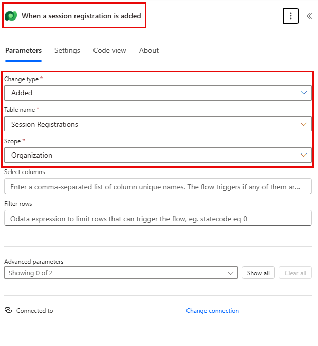
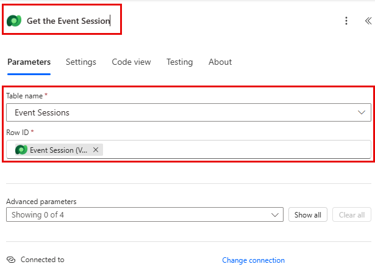

---
lab:
  title: 實驗室 6：建立 Power Automate 流程
  learning path: 'Learning Path: Demonstrate the capabilities of Microsoft Power Automate'
  module: 'Module 2: Build a Microsoft Power Automate flow'
---

## 學習目標

在本練習中，學習者將在 Power Automate 中使用 Microsoft Copilot 建立一系列不同的雲端流程。 您將使用不同的建立方法，例如 Copilot 和從頭開始，以熟悉可用的不同選項。

成功完成此練習後，您將：

- 使用自然語言提示來設計工作流程
- 設定觸發程式和動作
- 測試自動化以供實際使用。

### 案例

Contoso Consulting 是一家專門從事 IT 和 AI 諮詢服務的專業服務組織。 全年，他們都會為客戶提供許多不同的活動。 其中一些是貿易展覽風格的活動，他們有許多合作夥伴進來並提供有關新產品、市場趨勢和服務的詳細信息。 其他活動全年舉辦，是快速網路研討會，用於提供有關個別產品的詳細資訊。 此外，Contoso 開始使用自動化代理程式來協助客戶解決問題。

Contoso 想要使用 Power Automate 來建置註冊確認流程，當客戶註冊活動時，該流程將自動傳送電子郵件給客戶。 

在本練習中，您將根據特定準則建置一系列 Power Automate 流程。

在開始此練習之前，您必須先完成下列實驗室：

- **實驗室 2 – 建立資料模型**
- **實驗室 5 – 建置模型導向應用程式**

完成此練習的預計時間為 20 至 30 分鐘。

## 練習 1：建立工作階段註冊通知流程

在第一個練習中，您將建立一個流程，該流程將在建立新的工作階段註冊時自動執行。 它將獲取會議、活動和註冊聯繫人的詳細信息，並向其發送一封包含其註冊詳細信息的電子郵件。

### 工作 1：建立流程

我們希望向任何新註冊的用戶發送註冊確認。 我們將建立流程，以擷取註冊的詳細資料，並傳送確認電子郵件給註冊使用者。

1. 瀏覽至 [https://make.powerautomate.com](https://make.powerautomate.com/)。

1. 您可能需要重新驗證、選取 [登入]****，然後視需要依照指示操作。

1. 選取右上方的 [Dev One]**** 環境 (若尚未選取)。 （重要的是，請忘記執行此步驟）。

1. 在左側導覽中，選取 **[+ 建立**]。 （如果出現提示，請選取 **開始使用**。

1. 選取自動化  **雲端流程**。

1. 針對**流程名稱**，輸入 `Registration Notification`。

1. 在 [選擇流程的觸發程序] 中 **，搜尋 `Dataverse`。**

1. 選擇觸發程序 [當新增、修改或刪除資料列時]****，然後選取 [建立]****。

    如果您看到 **無效參數** 錯誤，這是因為您尚未驗證。 請依照下列步驟建立連線。 
    - 選取 [**變更連線]。**
    - 選取**新增**。
    - 在 [連線名稱 **] **欄位中，輸入 **MOD 管理員**。 將驗證類型保留**為 **OAuth**，然後選取登入 **。****
    - 登入後，請移至 **步驟 9。** 

1. 填入流程的觸發條件：

    - 為 [變更類型]**** 選取 [已新增]****
    - 選取 **[資料表名稱] 的 **[工作階段註冊**]。**
    - 選取 [範圍**的**組織]** 在**觸發步驟上。 

1. 重新命名觸發步驟 `When a Session Registration is added`。

    

這是個很好的做法，讓您和其他流程編輯者均可了解步驟的目的，而不必深入探討細節。

### 作業 2：建立步驟以取得註冊所針對之事件階段作業的詳細資料。

1. 選取 **+ 新步驟**。 

1. 搜尋 [ **依識別碼**取得資料列]。 

1. 選取**依識別碼取得資料列**動作。

1. 選取 **Event Sessions** 作為 **資料表名稱**

1. 選取 [資料列識別碼]**** 欄位。 請注意，圖示會出現以選取 **動態內容** 或 **運算式**。

1. 在 列ID 欄位中 **，從 動態內容** 清單中**選取 **事件工作階段 （值）。**** 在此步驟中，您將查詢**為觸發此流程而建立的「階段作業註冊 **」的**事件階段作業**。

1. 在 [依識別碼**取得資料列] **動作上。 重新命名此動作 `Get the Event Session`

    

    接下來，我們將獲取會話所在事件的詳細信息。

1. 在 [取得事件工作階段 **] **步驟下，選取 **[+ 插入動作]。**

1. 搜尋 [ **依識別碼**取得資料列]。 

1. 選取**依識別碼取得資料列**動作。

1. 選取 **[事件]** 作為 **[資料表名稱]**

1. 選取 [資料列識別碼]**** 欄位。 請注意，圖示會出現以選取 **動態內容** 或 **運算式**。

1. 在 列ID 欄位中 **，從 動態內容** 清單中**選取 **事件 （值）。**** 在此步驟中，您要查詢**上一個步驟中擷取之「事件工作階段」**的**事件**。

1. 在 [依識別碼**取得資料列] **動作上。 將此動作 `Get the Event`重新命名。

    

    最後，我們將獲取註冊會議的人的詳細信息。

1. 在 取得事件詳細資料 下，設定選取 插入 **新動作**。

1. 在搜尋欄位中輸入 **[依 ID** 取得資料列]。

1. 選取 [ **依識別碼**取得資料列]。

1. 選取 [聯絡人]**** 以取得 [資料表名稱]****

1. 選取 [資料列識別碼]**** 欄位。 請注意，會出現視窗提示您選取 [Dynamic 內容]**** 或 [運算式]****。

1. 在 列ID 欄位中 **，從 動態內容** 清單中的 **新增工作階段註冊**時 觸發器中**選取 **參與者 （值）** 欄位。**

1. 選取 [依識別碼**取得資料列] **文字，然後重新命名此動作 `Get Participant Details`。

    

### 作業 3：建立步驟以傳送電子郵件以確認階段作業註冊

1. 在 取得參與者詳細資料 步驟**下，選取 **插入新動作**。**

1. 在搜尋欄位 **中輸入 Send an email**。

1. 選取 [傳送電子郵件 (第 2 版)]****。

    系統可能會提示您建立與 Outlook 的連接，如果是這樣，請選擇「登入」**** 按鈕，然後使用 Mod 管理員**帳戶登入**。 

    

1. 在 [至 **] **欄位上方，選取 [齒輪]** **圖示。 從出現的功能表中，選取 **使用動態內容**。

     

1. 使用動態值，在 收**件者** 欄位中，選取 **取得參與者詳細資料**下的 **電子郵件**。

    

1. 在 主旨 欄位中 **，請確定它顯示 `Registration Confirmation`。**

1. 在 [電子郵件本文] **** 輸入下列文字：

    > **附註：** 動態內容需要放置在方括號中命名欄位的位置。 建議您先複製並貼上所有文字，然後在正確的位置新增動態內容。

    *`Dear {First Name}, Thank you for registering for our upcoming session {Session Name} on {Event Date}. {Speaker} will be your speaker in this session. Your session is scheduled to last {Duration (Hours)}. Check out our other session at our {Event Name}.`*

    *`Best regards,`*

    *`Events Administration`*
    
    *`Contoso Consulting`*

    接下來，我們將用下面概述的項目替換括號中的文本。

1. 醒目提示 **{First Name}** 文字。 將它取代為「取得參與者詳細資料」**** 步驟中的名字**欄位**。

1. 反白顯示 **{Session Name}** 文字。 將它取代為「取得事件工作階段」**** 步驟中的「**工作階段名稱**」欄位。

1. 反白顯示 **{事件日期}** 文字。 將它取代為「取得事件詳細資料」**** 步驟中的「**事件日期**」欄位。

1. 反白顯示 **{Speaker}** 文字。 將其取代為「取得事件工作階段 **」** 步驟中的「**演講者（值）」** 欄位。

1. 反白顯示 **{Duration （Hours）}** 文字。 將其取代為「取得事件工作階段 **」** 步驟中的「**持續時間（小時）」** 欄位。

1. 反白顯示 **{事件名稱}** 文字。 將其取代為「取得事件詳細資料」**** 步驟中的「事件名稱 **」** 欄位。

    您完成的步驟應類似於圖像：

    

1. 選取**儲存**。

    保持流程索引標籤開啟，以供下一個工作使用。 您的流程看起來應該像下面這樣：

### 作業 4：輸入一些範例資料

> **附註：** 如果您已完成實驗室 5 – 建置模型導向應用程式，您可以略過此工作並直接移至工作 5。 

1. 使用左側的導覽，選取 [應用程式]。

1. 將顯示的應用程式從「我的應用程式 **」變更**為 **「全部**」。

1. 將滑鼠懸停在「事件管理」**** 應用程式上，然後選取「播放 **」** 圖示。

1. 使用左側的導覽，選取 **[連絡人]。**

1. 在命令列上，選取 + 新增**按鈕**。

1. 在「新增聯絡人 **」** 畫面中，設定如下：

    - **名字：** 蘇珊娜

    - **姓氏：** 迪亞茲

    - **職位名稱：** 工程師

1. 在表單標頭中，選取 [連絡人類型 **] **旁的向下箭頭。

1. 將聯絡人類型**設定**為**揚聲器。**
    

1. 選取 [儲存] **** 按鈕以儲存連絡人，並將其保持開啟狀態。

1. 選取 [**+ 新增**] 按鈕。

1. 在「新增聯絡人 **」** 畫面中，設定如下：

    - **名字：** 埃德加

    - **姓氏：** 斯文森

    - **職位名稱：** 建築師

    - **電子郵件：** 輸入您的電子郵件地址 （重要，否則您的流程將不會執行）

1. 在表單標頭中，選取 [連絡人類型 **] **旁的向下箭頭。

1. 將連絡人類型**設定**為**參與者**。

1. 選取 [儲存 &amp; 關閉]**** 按鈕。

    接下來，我們將新增一個新事件。

1. 使用左側的導覽，選取 **[事件]。**

1. 在命令列上，選取 + 新增**按鈕**。

1. 在「新增事件 **」** 畫面中，設定如下：

    - **活動名稱：** 春季會議。

    - **活動日期：** 明天的日期。

    - **出席人數上限：** 500

    - **活動詳情：** 春季會議展示我們支持的供應商的最新產品和服務。

    - **活動類型：** 會議

    - **地點：** 西雅圖

    - **需要註冊：** 是/對

    

1. 選取 [儲存 &amp; 關閉]**** 按鈕。

    接下來，我們將為活動新增一個工作階段。

1. 使用左側的導覽，選取 **[事件工作階段]。**

1. 選取 [**+ 新增**] 按鈕。

1. 設定 **事件工作階段** ，如下所示：

    - **會話名稱：** 負責任的 AI

    - **會議日期：** 明天的日期

    - **所需時間：** 1.5 小時

    - **會議描述：** 對於所有新的人工智慧解決方案，負責任很重要。 我們將討論這些挑戰。

    - **演講者：** 蘇珊娜·迪亞茲

    - **活動：** 春季大會

    

1. 選取**儲存後關閉**按鈕。

 
### 作業 5：驗證和測試流程

1. 如有必要，請在瀏覽器中開啟一個新標籤並導航到 [https://make.powerapps.com](https://make.powerapps.com/)。 

1. 選取右上方的 [Dev One]**** 環境 (若尚未選取)。

1. 選取 [應用程式 **]**，然後開啟 **Contoso 事件管理應用程式**。

1. 保持此瀏覽器索引標籤處於開啟狀態，然後導覽回之前的流程索引標籤。

1. 在命令列上，選取 [測試]****。 選取 [手動]**** 然後選取 [測試]****。

1. 保持模型驅動應用程式開啟，並巡覽至瀏覽器索引標籤。

    最後，我們將建立會 **話註冊**。

1. 使用左側的導覽，選取 **[工作階段註冊]。**

1. 在命令列上 **，選取 **+ 新增**。**

1. 按如下方式完成會話註冊：

    - **名稱：**`E, Swenson Registration`。

    - **報名日期：** 今天日期

    - **參與者：** `Edgar Swenson`

    - **會議：** `Responsible AI`

    

1. 選取 [儲存後關閉]**** 按鈕。

1. 導覽至流程測試執行的瀏覽器索引標籤。 短暫延遲之後，您應該會看到流程正在執行。 您可以在其中攔截任何流程中的問題，或確認流程已成功執行。

短暫延遲後，您應該會在收件匣中看到電子郵件。

> **注意：** 其可能會移至您的 [垃圾郵件] 資料夾。
