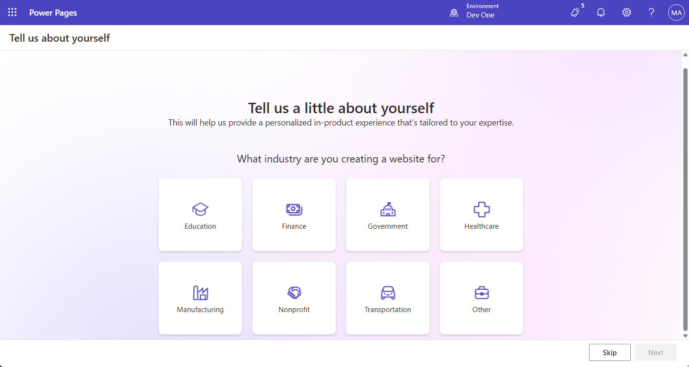

---
lab:
  title: 實驗室 6：建立 Power Pages 網站
  learning path: 'Learning Path: Demonstrate the capabilities of Microsoft Power Pages'
  module: 'Module 2: Create a Microsoft Power Pages site'
---
## 學習目標

在本練習中，學習者將會使用 Copilot 來建置 Power Pages 網站。 建立網站之後，您將使用Power Pages Design Studio 來執行新增和修改內容，以及變更主題等工作。

### 案例

全年，Contoso 諮詢會舉辦許多不同類型的活動。 他們從親自活動到網路研討會、講師領導訓練等等。 他們想要使用 Microsoft Power Platform 來管理所放置的不同事件。 他們想要使用Power Pages 建立事件管理網站，以顯示他們裝載的不同事件。

完成此練習之後，您將：

-   使用 Copilot 建置事件管理網站。
-   將新內容新增至您的網站。
-   預覽不同類型裝置的新Power Pages網站。

**實驗室詳細數據：**

開始本練習之前，您必須先完成下列實驗室：

- **實驗室 2 – 建立數據模型**

> **重要事項：** 此實驗室會使用 AI 來建置元件。 由於 AI 結果可能會有所不同，因此請務必注意，您的結果可能會與實驗室中定義的結果不同（但類似）。 實驗室中概述的基本概念將會是相同的，無論所建立的專案或所命名的內容為何。 如果數據表和數據行不完全相符，您可能需要調整為您建立的專案。

完成此練習的估計時間為 **30 到 45** 分鐘。

**開始之前：** 如果這是您第一次存取 Power Pages 製作者入口網站，您可能需要執行某些設定。  若是如此，請遵循下列指示。  否則，您可以繼續工作 **1。**  

1.  如有必要，請流覽至 [Microsoft Power Pages](https://make.powerpages.microsoft.com)。
1.  在 [ **歡迎使用 Power Pages]** 畫面上，選取 [ **開始使用]** 按鈕。

    

1. 在 [ **告訴我們一點關於自己** ] 畫面上，選取 [ **略過** ] 按鈕。

    

## 工作 1：使用 Copilot 建立新的 Power pages 網站。

1.  如有必要，請流覽至 <https://make.powerpages.microsoft.com>
1.  在 **Power Pages設計工作室** 首頁上，輸入下列文字：「*建置網站來管理組織主機的事件」。*
1.  選取 [Send]**** \(傳送\) 按鈕。
1.  在 [ **檢查基本網站詳細** 數據] 畫面中，設定如下：
    - **提供您的網站名稱：** `Contoso Event Management`
    - **建立網址：** 接受提供的預設位址
    - **網站語言：** 英文

    

1.  選取 [下一步]**** 按鈕。
1.  在 [ **選擇版面配置** ] 畫面中，檢閱所提供的建議版面配置。 如果您想要其他版面配置建議，請選取 [ **再試一次** ]，讓 **Copilot** 建議另一個配置。
1.  識別要使用的範本之後，請選取 [ **下一步]。**
1.  在 [ **新增通用頁面]** 區段中，選取下列頁面：
    - 關於我們
    - 連絡我們
    - 常見問題集
    - 視需要選取任何其他頁面。
1.  選取頁面之後，請選取 [ **完成**]。

    您的新網站將會在背景中建立，這可能需要幾分鐘的時間。

1.  建立您的網站之後，請開啟它（如果尚未帶到該處）。

    > **注意：** 有時當您的網站第一次載入時，您可能會看到 Liquid 物件找不到訊息。 如果發生這種情況，請重新整理瀏覽器視窗以重載網站。 網站應該會出現。

## 工作 2：修改網站的內容

現在已建立初始網站，您可以使用設計工作室來新增頁面、文字、影像、表單等來修改網站。

1.  **主要流覽**，選取 **[首頁** ] 以開啟 **[首頁** ]。
1.  將滑鼠停留在 **網站標頭中的 Contoso 事件管理網站** 文字上，然後選取 [ **編輯網站標頭**]。
1.  將網站**標題變更為 **Contoso 諮詢****。
1.  選取 [ **上傳影像]** 按鈕。
1.  在 [ **新增影像** ] 畫面上，選取 **[上傳影像**]，從您的類別檔案選擇 **[Contoso 標誌** ]，然後選擇 [ **開啟**]。
1.  選取 [ **Contoso 標誌** ] 影像后，選取 [ **確定**]。
1.  完成變更之後，請選取 **X 以離開 **[編輯網站標頭**]** 畫面。
1.  若要變更網站背景影像，請按兩下背景影像中的任何位置。
1.  從出現的功能表中，選擇 [ **編輯背景**]。
1. 選取 [ **變更影像]** 按鈕。
1. 選取 **[媒體媒體櫃** ]，然後選擇 [ **上傳影像**]。
1. 從類別檔案中選取 **Site_Background** 映射，然後選擇 [ **開啟**]。
1. 選取Site_Background后，選擇 [ **確定**]。
1. 選取 [歡迎使用 Contoso 事件] 文字 **，並將文字變更為 **Contoso 諮詢**。**
1. 在出現的工具列上，選取 [**設計***] [畫筆刷]* 按鈕。
1. 選取 [文字陰影] 屬性旁的**箭號，並將 H-Offset** 設定**為 **2**。**
1. 選取 X **** 以關閉 [**文字設計**] 視窗。
1. 選取 Contoso 諮詢 *下方的文字（可能會說出類似您活動管理中的合作夥伴），* 並將它變更為 **您的合作夥伴，以供今天和明天使用。**

    既然我們已對首頁進行一些基本變更，我們將更新網站的主題，以更符合 Contoso 的品牌。

1.  使用左側導覽，選取 [ **樣式]** 按鈕。
1.  **選取 [明亮的藍色**] 主題。
1.  在 [品牌色彩]** 底下**，選取 **[灰色**色彩] 圓形。
1.  **變更十六進位**色彩 **：101E2B**
1.  選取 [確定]。
1.  選取白色**** 圓形，並將色彩變更為 **Hex** 程式代碼 **e8e8e8**
1.  選取 [確定]****
1.  **選取 [黑色**] 圓形，並將色彩變更為 **[白色**]。 （ffffff）
1.  選取 [確定]。
1. 進行您想要的任何其他主題變更。 完成主題變更之後，請選取 [ **儲存]** 按鈕。

## 工作 3：將您的網站連線到您的商務數據

Power Pages 的主要優點之一是能夠將 Power Pages 連接到 Dataverse 中的商務數據。 在我們可以帶入數據之前，我們需要建置一些將使用的專案。

1.  使用左側導覽，選取 **[數據]** 圖示。
1.  在 [ **搜尋]** 欄位中，輸入 **[事件**]。
1.  選取 [事件]**** 資料表。

    首先，我們將建立表單，以在我們想要新增事件時使用。

1.  選取 [表單] 索引**卷標，然後選擇 [**+ 新增表單**]。**
1.  將 [ **表單名稱]** 設定為 `Create Event`，然後選取 [ **建立]** 按鈕。
1.  我們不會對版面配置進行任何修改。 選取 [ **儲存併發佈]** 按鈕。
1.  按 [ **上一頁] 箭號** 以返回設計工具。

    接下來，我們將建立將用於檢視和編輯現有事件的窗體

1.  選取 [ **+ 新增表單]** 按鈕。
1.  將表單 **命名為 [檢視事件** ]，然後選取 [ **建立]** 按鈕。
1.  在命令行**上，選取 **[** 新增元件**]，然後選取 [**子格]。**
1.  設定 Subgrid，如下所示：
    -   **顯示相關記錄：** 是
    -   **數據表：** 事件會話
    -   **預設值：** 使用中的會話
1.  選取**完成**。
1.  選取 [ **儲存併發佈]** 按鈕。
1.  選取 [ **上一頁]** 按鈕以返回 **Design Studio**。

## 工作 4：建立必要的網頁窗體

既然我們已定義事件數據表的表單，我們將建立包含這些表單的頁面，讓網站用戶能夠使用事件記錄。 我們將建立頁面來檢視、建立和編輯事件。

1.  使用左側導覽，選取 **[頁面** ] 圖示。
1.  選取 [ **+ 頁面]** 按鈕。
1.  在 **[Copilot**] 中，輸入下列文字：*`Add a new blank page.`* 選取 [**傳送**] 按鈕。
1.  選取 [ **保留它]** 按鈕。
1.  在新頁面頂端，選取 [ **新增區段** ] 按鈕。
1.  選取 **[1 欄**]。
1.  在 **[選擇要新增至本節**的元件] 中，選取 [ **窗體**]。
1.  選取 **+ 新增表單**。
1.  在 [ **新增表單** ] 畫面上，設定如下：
    - **選擇數據表：** 事件
    - **選取表單：** 建立事件
    - **為您的選取表單複本命名：** 建立事件
1. 選取 [**數據]** 索引標籤，並確認此表單**的數據**已設定為 **[建立新記錄**]。
1. 選取 [ **提交時]** 索引標籤。在 [ **顯示此訊息** ] 欄位中，輸入 *`Your event has been successfully submitted.`*
1. 選取 [確定] **** 按鈕。

    讓我們移除頁面上的任何其他區段，因為我們不需要它們。

1. **選取您剛才新增的窗體**下方的**區段**。 在出現的工具列上，選取 [更多 **][...]，** 然後選擇 [ **刪除**]。
1. 重複上一個步驟，從頁面移除其餘兩個區段。

    完成後，唯一應該保留的專案就是您所建立的窗體，以及頁面底部的頁尾。

1. 在**左側的 [主要] 流覽**下，選取您所建立之 [新增頁面 **] 旁的**省略號。
1. 從出現的功能表中，選取 **[頁面設定**]。
1. 設定頁面設定，如下所示：
    - **名稱：** 新事件
    - **部分 URL：** New-Events
1. 選取 [確定] **** 按鈕。

    接下來，我們將新增可用於檢視個別事件的其他頁面。

1.  請確定您仍然已 **選取 [頁面** ]，然後按兩下 [ **+ 頁面]** 按鈕。
1.  在 [ **描述要建立的頁面** ] 畫面中，輸入： *`Add a Blank Page named View Event.`* 選取 [ **傳送** ] 按鈕。
1.  選取 [ **保留它]** 按鈕以接受新頁面。
1.  在新頁面頂端，選取 [ **新增區段** ] 按鈕。
1.  選取 **[1 欄**]。
1.  在 **[選擇要新增至本節**的元件] 中，選取 [ **窗體**]。
1.  選取 **+ 新增表單**。
1.  在 [ **新增表單** ] 畫面上，設定如下：
    - **選擇數據表：** 事件
    - **選取表單：** 檢視事件
    - **為您的選取表單複本命名：** 檢視事件
1.  選取 [**數據]** 索引標籤，並將此表單**域的 [數據] 設定**為 **[只讀**]。
1. 選取 [確定] **** 按鈕。

    讓我們移除頁面上的任何其他區段，因為我們不需要它們。

1. **選取您剛才新增的窗體**下方的**區段**。 在出現的工具列上，選取 [更多 **][...]，** 然後選擇 [ **刪除**]。
1. 重複上一個步驟，從頁面移除其餘區段。
1. 在 **左側的 [主要] 導覽** 下，選取 **您所建立新頁面旁的省略號** 。
1. 從出現的功能表中，選取 **[頁面設定**]。
1. 設定頁面設定，如下所示：
    - **名稱：** 檢視事件
    - **部分 URL：** View-Events
1. 選取 [確定] **** 按鈕。

    最後，讓我們再建立一個網頁窗體，可用來編輯事件。

1.  請確定您仍然已 **選取 [頁面** ]，然後按兩下 [ **+ 頁面]** 按鈕。
1.  在 [ **描述要建立的頁面** ] 畫面中，輸入： *`Add a Blank Page named Edit Event.`* 選取 [ **傳送** ] 按鈕。
1.  選取 [ **保留它]** 按鈕以接受新頁面。
1.  在新頁面頂端，選取 [ **新增區段** ] 按鈕。
1.  選取 **[1 欄**]。
1.  在 **[選擇要新增至本節**的元件] 中，選取 [ **窗體**]。
1.  選取 **+ 新增表單**。
1.  在 [ **新增表單** ] 畫面上，設定如下：
    - **選擇數據表：** 事件
    - **選取表單：** 建立事件
    - **為您的選取表單複本命名：** 編輯事件
1.  選取 [**數據]** 索引標籤，並將此表單**的 **[資料] 設定為 [**更新現有的記錄**]。
1. 選取 [確定] **** 按鈕。

    讓我們移除頁面上的任何其他區段，因為我們不需要它們。

1. **選取您剛才新增的窗體**下方的**區段**。 在出現的工具列上，選取 [更多 **][...]，** 然後選擇 [ **刪除**]。
1. 重複上一個步驟，從頁面移除其餘區段。
1. 選取 [確定] **** 按鈕。

## 工作 5：建立顯示事件列表的頁面

既然我們已定義要用來管理記錄的必要窗體，我們將建立頁面檢視來顯示這些記錄。

1.  選取 [ **+ 頁面]** 按鈕。

1.  在 [ **描述要建立的頁面** ] 畫面中，輸入： *`Add a blank page called events.`* 選取 [ **傳送** ] 按鈕。
1.  選取 [ **保留]** 以接受新的頁面。
1.  在新頁面頂端，選取 [ **新增區段** ] 按鈕。
1.  選取 **[1 欄**]。
1.  在 **[選擇要新增至本節**的元件] 中，選取 [ **更多** ] 按鈕 *（...）*。 在 [ **已連線的數據群組]** 下，選取 [ **列表**]。
1.  在 [ **新增清單** ] 畫面中，選取 [ **設定** ] 索引標籤，然後設定如下：
    - **選擇數據表：** 事件
    - **選取數據檢視：** 作用中事件、非使用中事件
    - **您列出的名稱：** `Events`
1.  選取 [ **動作]** 索引標籤，並設定如下：
    - **建立新記錄：** 開啟
        - **目標類型：** 表單
        - **表單：** 建立事件
        - **顯示標籤：** `Create New Event`
    - **檢視詳細數據：** 開啟
        - **目標類型：** 表單
        - **表單：** 檢視事件
        - **顯示標籤：** `See Event Details`
    - **編輯記錄：** 開啟
        - **目標類型：** 表單
        - **表單：** 編輯事件
        - **顯示標籤：** `Edit Event`
1. 選取**完成**。

## 工作 6：更新許可權

為了確保使用者只會看到與其組織相關的數據，可以指定數據表許可權。 在此工作中，我們將建立非常基本的許可權，以提供任何人的存取權。

1.  在 [主要導覽 **] 底下**，選取 [**事件]** 頁面。
1.  選取 [ **事件** ] 列表，然後按下 [ **+ 新增權限]** 按鈕。
1.  設定許可權，如下所示：
    -   **名稱：** 事件
    -   **數據表：** 事件
    -   **存取類型：** 全域存取
1.  **將 [許可權**] 設定為 **[讀取**]。
1.  選取 **[新增角色**]，然後選擇 **[系統管理員**]、 **[匿名使用者**] 和 **[已驗證的使用者** ] 角色。
1.  選取 [儲存]**** 按鈕。
1.  顯示任何人**可以看到數據的畫面**，請選取 [**儲存**]。

    讓我們針對事件表單頁面重複該程式。 我們將從 [ **新增事件** ] 頁面開始

1.  在 [主要導覽 **] 底下**，選取 [**新增事件]** 頁面。
1.  選取 [ **更新許可權]** 按鈕。
1.  設定許可權，如下所示：
    -   **名稱：** 建立事件
    -   **數據表：** 事件
    -   **存取類型：** 全域存取
1.  將 [許可權 **] 設定為 **[** 讀取**] 和 **[建立**]。
1.  選取 **[新增角色**]，然後選擇 **[系統管理員**]、 **[匿名使用者**] 和 **[已驗證的使用者** ] 角色。
1.  選取 [儲存 **]** 按鈕，然後在快顯畫面上再次選取 **[儲存** ]。

    接下來，我們將針對 **[編輯事件** ] 畫面進行設定。

1.  在 [主要導覽 **] 底下**，選取 [**編輯事件**] 頁面。
1.  選取 [ **更新許可權]** 按鈕。
1.  設定許可權，如下所示：
    -   **名稱：** 建立事件
    -   **數據表：** 事件
    -   **存取類型：** 全域存取
1.  將 [許可權 **] 設定為 **[** 讀取**和**更新**]。
1.  選取 **[新增角色**]，然後選擇 **[系統管理員**]、 **[匿名使用者**] 和 **[已驗證的使用者** ] 角色。
1.  選取 [儲存 **]** 按鈕，然後在快顯畫面上再次選取 **[儲存** ]。

## 工作 7：更新網站導覽

既然我們已經將頁面和專案格式化為我們想要的方式，我們將據此調整網站流覽。

1.  在 **[主要導覽**] 底下，選取 **[事件 **] 頁面旁邊的**省略號**。

1.  從出現的功能表中，選取 **[上**移]。
1.  重複步驟，**** 直到位於 [與我們**連絡] 頁面下方的事件**頁面為止。
1.  請確定 [**新增事件] 頁面位於 [事件****] 頁面正下方**。 *（如果沒有，請將 [新增事件] 頁面移至該頁面。）*
1.  在 [ **新增事件]** 頁面上，選取 **省略號** 按鈕。
1.  從出現的功能表中，選取 **[將此設為子頁面**]。
1.  選取 [檢視事件 **] 旁的**省略號，然後選取 [**移至其他頁面**]。
1.  選取 [編輯事件 **] 旁的**省略號，然後選取 [**移至其他頁面**]。
1.  在 **命令行**上，選取 [ **同步處理]** 按鈕。

## 工作 8：預覽和精簡您的網站

建立您的網站之後，您會想要檢閱它，以確保它符合您的業務需求和需求，以便判斷所需的任何精簡專案。 您可以在桌面和行動模式中預覽網站

1.  在設計工作室中，選取 **[首頁** ] 按鈕。
1.  從命令行按兩下 **[預覽** ]。
1.  選取 **[桌面]** 以在瀏覽器中預覽您的網站。
1.  在桌面**模式中**檢視時，請檢閱網站的下列層面，例如：
    -   版面配置和流覽。
    -   商標元素，例如色彩、字型和標誌。
1.  完成網站測試之後，請關閉 [ **瀏覽器] 索引標籤** 以返回網站編輯器。

    接下來，我們將預覽網站，因為它會顯示在行動裝置上。

1.  再次選取 [ **預覽]** 按鈕。
1.  **掃描隨行動裝置顯示的 QR 代碼**。
1.  月臺將會在您的行動裝置 *上開啟（注意：系統可能會提示您登入，如果是的話，請提供您的登入認證。*
1.  如同您在桌面模式中所做的，請檢閱網站的下列層面，例如：
    - 版面配置和流覽。
    - 商標元素，例如色彩、字型和標誌。
1. 完成測試之後，請關閉瀏覽器索引標籤以返回網站。

