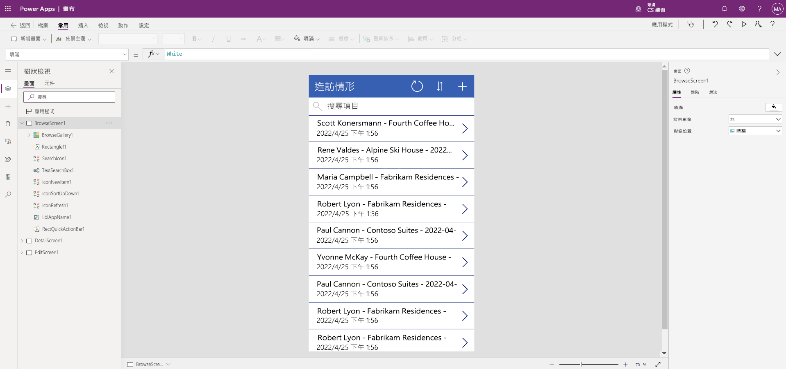

---
lab:
  title: 實驗室 2：如何建置畫布應用程式
  module: 'Module 3: Get started with Power Apps'
---

# 實驗室 2：如何建置畫布應用程式

**WWL 租用戶 - 使用條款**如果您針對講師導向訓練交付的一部分取得租用戶，請注意，租用戶的功能是為了在講師導向訓練中支援實際操作實驗室。 租用戶不應共用，或用於實際操作實驗室以外的用途。 本課程中使用的租用戶是試用租用戶，無法在課程結束後使用，且不符合擴充資格。 租用戶不得轉換成付費訂用帳戶。 此課程中提供的租用戶仍是 Microsoft Corporation 的財產，我們保留隨時取得存取權和重新持有的權利。 

## 案例

Bellows College 是一個教育組織，校園內有多棟大樓。 校園訪客造訪情況目前記錄在紙本日誌中。 此資訊並未以一致的方式擷取，而且也無法收集和分析整個校園造訪的相關資料。

目前，校園行政單位利用 Excel 試算表來追蹤訪客登記。 他們想要更新其訪客登記系統，讓保全人員控管各棟大樓的出入狀況，且所有造訪都必須由大樓負責人預先登記和記錄。

在整個課程中，您將建立應用程式並執行自動化功能，以便 Bellows College 的行政和保全人員能夠管理及控管校內大樓的出入狀況。

## 高階實驗室步驟

我們將遵循以下大綱來設計畫布應用程式：

- 從 [造訪] 資料表中的資料建立畫布應用程式

- 設定造訪在瀏覽畫面上的顯示方式

- 對應用程式進行一些基本變更

- 測試應用程式功能

## 必要條件

- 課程模組 1 實驗室 0 完成 **- 驗證實驗室環境**
- 完成**課程模組 2 實驗室 1 - 資料模型化**

## 練習 1：建立造訪畫布應用程式

**目的：** 在此練習中，您將連線稍早建立的「造訪」資料表，以建立畫布應用程式。

### 工作 \#1：建立造訪應用程式

1.  導覽到 `https://make.powerapps.com`

2.  您可能需要重新驗證 - 視需要選取 **[登入** ]，並遵循指示。

3.  **如果尚未選取，請選取右上方的 Dev One** 環境。

4.  從畫面左側導覽選取 [+ 建立]****。 在 [開始]**** 區段底下，選取 [Dataverse]****。

5.  選取您的 Dataverse 連線。

    > **注意：***若 Dataverse 連線不存在：*
    > - 選取 [+ 新連線]****。
    > - 尋找 [Microsoft Dataverse]****
    > - 選取 **[建立]**
    > - **登入**並選取 [允許存取]****

6.  尋找並選取您在上一個實驗室中建立的 [造訪]**** 資料表。

7.  選取右下角的 [連線]**** 按鈕。

8.  建立您的應用程式之後，在「歡迎使用 Power Apps Studio」畫面上，選取 [下次不要再顯示]****，然後選取 [跳過]****。

9.  建立完成後，畫布應用程式看起來應該像下圖。

    

10.  在應用程式設計工具中，選取命令列上的 [preview the app] (預覽應用程式)**** 按鈕 (播放圖示)。 *(您也可以按 F5 來預覽應用程式。)* 整體檢視一下，看看推出的應用程式是什麼樣子。

11. 選取畫面右上方的 **X** 以關閉應用程式預覽。

恭喜，您已成功從 Dataverse 資料表建立 Power App。 程序中的下一個步驟是量身打造應用程式，以符合您 Bellows College 的品牌。 下一系列的步驟將逐步引導您提供一些額外的自訂給應用程式。

### 工作 \#2：修改新建立的應用程式並為其設定佈景主題

在此工作中，您將會為您應用程式的三個畫面 (瀏覽、詳細資料和編輯) 自訂標題文字，以及變更應用程式主題。 

1.  您在 [瀏覽] 畫面上。 選取畫面上的 [造訪]**** 標籤。

1.  在畫面右側的 [屬性] 索引標籤下，將 [文字]**** 控制項屬性更新為 `Bellows College Visits`。

1.  在 [屬性] **** 索引標籤中，將**字型大小**變更為**24**。 

1.  選取畫面上的空白背景，以在您的 [瀏覽] 畫面上查看更新的文字。 

1.  在左側導覽中使用**樹狀檢視**，選取 **DetailScreen1**。 

1.  選取畫面上的 [造訪]**** 標籤。

1.  在畫面右側的 [屬性]**** 索引標籤下，將 [文字]**** 控制項屬性更新為 `Visit Details`。

1.  按一下畫面上的空白背景，以在您的 [詳細資料] 畫面上查看更新的文字。

1.  使用左側導覽的**樹狀檢視**，選取 **EditScreen1**，您可能需要向下捲動才能在樹狀檢視上查看此項目。

1.  選取畫面上的 [造訪]**** 標籤。

1.  在畫面右側的 [屬性]**** 索引標籤中，以 `Edit Details` 來取代 [文字]**** 控制項屬性中的文字。

1.  按一下畫面上的空白背景，以在您的 [編輯] 畫面上查看更新的文字。

1.  在左側導覽中使用**樹狀檢視**，選取 **BrowseScreen1**。

1.  在命令工具列上，選取 [佈景主題]**** 按鈕，然後從出現的清單中選取 [紅色]**** 佈景主題色彩。

### 工作 \#3：測試您的造訪應用程式

在此工作中，您將會測試您的新應用程式。

1.  在應用程式設計工具中開啟應用程式後，選取 [設定]****，並在 [一般]**** 區段將您應用程式的名稱更新為 `Visits App`，然後按一下 **X** 關閉設定畫面，接著選取 [儲存]****。

2.  使用左側的巡覽功能，選取 **BrowseScreen1**。

3.  在應用程式設計工具中，選取命令列上的 [preview the app] (預覽應用程式)**** 按鈕 (播放圖示)。 *(您也可以按 F5 來預覽應用程式。)*

4.  開啟應用程式之後，在 [搜尋項目]**** 欄位中，輸入文字 `Maria`
     *(注意資源庫中的項目如何根據搜尋欄位中鍵入的內容進行篩選)。*

5.  **Maria Campbell** 的 **Contoso Suites** 記錄顯示後，選取資料列以導覽並開啟該造訪的詳細資料畫面。 (**注意**：*如果顯示多個 Contoso 套件 Maria Campbell 記錄，請選取其中任何一筆記錄。*)

6.  若要編輯記錄，請選取應用程式右上角的**鉛筆圖示**。

7.  您可以在此編輯 [造訪名稱]****，並按一下右上角的 [核取記號]**** 來儲存變更。

8.  按一下畫面右上角的 **X** 圖示以關閉預覽模式並返回畫布應用程式編輯器。

恭喜！ 您已建立並設定第一個畫布應用程式。

