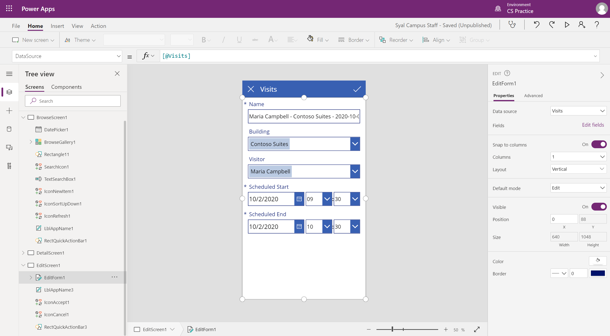

---
lab:
    title: '實驗室 2：如何建立畫布應用程式 (第 1 部分)'
    module: '單元 3：Power Apps 入門'
---

# 單元 3：Power Apps 入門

## 實驗室：如何建立畫布應用程式 (第 1 部分)

# 案例

Bellows College 是一個教育組織，校園內有多棟大樓。校園訪客造訪情況目前記錄在紙本日誌中。此資訊並未以一致的方式擷取，而且也無法收集和分析整個校園造訪情形的相關資料。 

校園行政單位想要更新其訪客登記系統，讓保全人員控管各棟大樓的出入狀況，且所有造訪情形都必須由大樓負責人預先登記和記錄。

在整個課程中，您將建立應用程式並執行自動化功能，以便 Bellows College 的行政和保全人員能夠管理及控管校內大樓的出入狀況。  

在此實驗室的第 1 部分中，您將設計一個 Power Apps 畫布應用程式，可讓大學教職員用來管理其訪客造訪情形。

# 高階實驗室步驟

我們將依照以下大綱設計畫布應用程式：

-   使用手機尺寸規格範本透過資料建立應用程式
-   設定含有造訪資訊的詳細資料頁面
-   設定編輯頁面以建立造訪情形
-   設定資源庫控制項以顯示造訪情形
-   針對資源庫資料來源新增篩選功能，以便僅顯示未來的造訪情形

## 先決條件

* 完成**單元 0 實驗室 0：驗證實驗室環境**
* 完成**單元 2 實驗室 1：Microsoft Dataverse 簡介**

## 開始前要考慮的事項

-   對目標對象而言，最普遍的尺寸規格是什麼？
-   預估系統中的記錄數目 
-   如何縮小選定記錄以提升應用程式效能和使用者採用率

# 練習 1：建立教職員畫布應用程式

**目標：** 在此練習中，您將透過範本建立畫布應用程式，然後進行修改以包含必要資料。

## 工作 1：建立畫布應用程式

在此工作中，您將使用以 Microsoft Dataverse 為基礎的手機配置範本，建立畫布應用程式。此範本使用 [造訪情形] 做為 Dataverse 的選定資料表，可產生 [資源庫 - 檢視 - 編輯] 應用程式來管理校園造訪情形。

1.  開始從資料建立應用程式

    -   登入 <https://make.powerapps.com>

    -   在右上方選取您的**環境** (若尚未設為
        您的「練習」環境)。

    -   在主畫面上的 **[從資料開始]** 中選取 **[Dataverse]** 圖示。

2.  連線到您的 Visits 資料表
    
    -   選取 **[+ 新增連線]**

    -   選取 **[Microsoft Dataverse]**，然後按一下 **[建立]**

    -   找到並選取 **Visits** 資料表

    -   選取 **[連線]**

3.  可能會顯示 **[歡迎使用 Power Apps Studio]** 視窗。按一下 **[略過]**。

4.  儲存應用程式

    -   按一下 **[檔案] \> [儲存]**

    -   輸入 [[您的姓氏] 校園教職員] 做為 **[應用程式名稱]**。

    -   按 **[儲存]**。

## 工作 2：設定「造訪情形」詳細資料表單

在此工作中，您將設定詳細資料表單，以檢視個別造訪情形記錄的相關資訊

1. 選取左上方的**上一步**箭頭，以返回應用程式定義。

2. 展開 **[樹狀檢視]** 底下的 **[DetailScreen1]**

3.  選取 **[DetailForm1]**

4.  在右側面板中，選取 **[欄位]** 旁邊的 **[編輯欄位]**。

5.  按一下 **[新增欄位]**

6.  選取下列欄位：

    * 實際結束時間
    
    * 實際開始時間
    
    * 大樓 
    
    * 代碼
    
    * 預定結束時間
    
    * 預定開始時間
    
    * 訪客
    
7.  按一下 **[新增]**

8.  向上或向下拖放欄位名稱，即可在 **[欄位]** 窗格中重新排列欄位。建議順序如下：
    * [代碼]、[名稱]、[大樓]、[訪客]、[預定開始時間]、[預定結束時間]、[實際開始時間]、[實際結束時間]
    >**提示：** 只要按一下欄位名稱旁邊的向下箭頭，即可摺疊每個欄位。

9.  按一下欄位名稱旁邊的省略符號 (**...**)，然後選取 **[移除]**，即可移除 **[建立時間]** 欄位。 

10.  關閉 **[欄位]** 窗格。
 
11.  若要保留進行中的工作，請按一下 **[檔案]**，然後按一下 **[儲存]**。使用上一步箭頭返回應用程式。

## 工作 3：設定造訪情形編輯表單

在此工作中，您將設定表單，以編輯個別造訪情形資料列的相關資訊。

1.  展開 **[樹狀檢視]** 底下的 **[EditScreen1]**

2.  選取 **[EditForm1]**

3.  選取 **[建立時間]** 欄位，然後按下 **Del** 鍵以移除欄位

4.  在屬性面板中選取 **[編輯欄位]**

5.  按一下 **[新增欄位]**

6.  選取下列欄位：

    * 大樓 
    
    * 預定結束時間
    
    * 預定開始時間
    
    * 訪客
    
7.  按一下 **[新增]**

8.  向上或向下拖放欄位名稱，即可在 **[欄位]** 窗格中重新排列欄位。建議順序如下：
    
    * [名稱]、[大樓]、[訪客]、[預定開始時間]、[預定結束時間]
    >**提示：** 只要按一下欄位名稱旁邊的向下箭頭，即可摺疊每個欄位。 

9.  關閉 **[欄位]** 窗格。

10.  若要保留進行中的工作，請按一下 **[檔案]**，然後按一下 **[儲存]**。使用上一步箭頭返回應用程式。

您的畫面看起來應近似於下圖：



## 工作 4：設定「造訪情形」資源庫

在此工作中，您將設定預先產生的資源庫，以顯示造訪情形的標題、開始日期及結束日期。 

1.  展開 **[樹狀檢視]** 底下的 **[BrowseScreen1]**

2.  選取 **[BrowseGallery1]**

3.  在右側的 [進階屬性] 面板選取 **[TemplateSize]** 屬性

4.  以下列內容取代運算式：`Min(150, BrowseGallery1.Height - 60)`。該內容可確保其他資訊有足夠的空間。

5.  在應用程式預覽中，選取資源庫中的第一個 [日期時間] 欄位。

6.  在上方公式列中，將 ThisItem.'Created On' 變更為 `ThisItem.'Scheduled Start'`

7.  再次選取欄位

8.  按下 **CTRL-C**，然後按下 **CTRL-V**，以建立欄位的複本。

9.  使用滑鼠或鍵盤，將複製的控制項向下移並對齊其他資源庫中的控制項 (在其他 [日期時間] 欄位下方])。

10.  在上方的公式列中，將 **ThisItem.'Scheduled Start'** 變更為 `ThisItem.'Scheduled End'`

11.  若要保留進行中的工作，請按一下 **[檔案]**，然後按一下 **[儲存]**。使用上一步箭頭返回應用程式。

## 工作 5：新增日期篩選條件

由於造訪情形的數量不斷增加，因此使用者需要可篩選造訪情形資源庫的功能。例如，使用者可能只想看到未來的造訪情形。在此工作中，您將新增可僅顯示使用者選定日期之後之造訪情形的功能。

1. 選取 **[BrowseScreen1]**

2. 選取上方的 **[插入]** 功能表。

3. 按一下 **[輸入]**，然後選取 **[日期選擇器]**。

4. 使用鍵盤或滑鼠，將控制項置於搜尋方塊下方。

5. 選取 **[BrowseGallery1]** 

6. 調整資源庫控制項大小並移動位置，使其位於日期選擇器下方並覆蓋畫面。只要按一下資源庫控制項頂端中央的調整大小圖示，然後將控制項大小調整至日期選擇器後面的開始時間即可。

7. 在選取 **[BrowseGallery1]** 時，按一下 [屬性] 窗格的 **[進階]** 索引標籤。

8. 找到 **[Items]** 屬性，然後在文字方塊中按一下。

9. 在運算式中，找到 **[@Visits]** 並將其取代為 `Filter(Visits,'Scheduled End' >= DatePicker1.SelectedDate)`。整個運算式看起來應如下所示：

   ```
   SortByColumns(
   	Search(
        Filter(
        	Visits,
            'Scheduled End' >= DatePicker1.SelectedDate
           ),
           TextSearchBox1.Text,
       	"bc_code","bc_name"
       ),
     "bc_scheduledstart",
     If(SortDescending1, Descending, Ascending)
   )
   ```
   
10. 若要保留進行中的工作，請按一下 **[檔案]**，然後按一下 **[儲存]**。使用上一步箭頭返回應用程式。

您的畫面看起來應近似於下圖：


# 練習 2：完成應用程式

在此練習中，您將測試應用程式；如果測試成功，即可將其新增至您的解決方案。

## 工作 1：測試應用程式

1.  啟動應用程式

    -   選取 **[BrowseScreen1]** 並按下功能鍵 **F5**，或按一下右上角的 **[播放]** 圖示，預覽應用程式。
    
    -   應用程式應上傳並顯示造訪情形清單。 
    
    -   在日期選擇器控制項中，選取不同日期以測試篩選條件
    
    -   選取造訪情形，並確認顯示表單是否正常運作
    
    -   返回資源庫，然後按下 **+** 以建立新的造訪情形。確認編輯表單是否包含必要的資料行，包括訪客、大樓，以及預定開始日期和結束日期。
    
    -   填寫資訊並提交。確認新記錄是否出現在資源庫中。
    
    -   再建立至少 2 個造訪情形。
    
    -   按下 **ESC** 鍵或按一下 **[X]** 圖示以關閉預覽模式。

2.  儲存並發佈應用程式

    -   按一下 **[檔案]**；如果顯示 [儲存] 按鈕，請按一下 **[儲存]**。

    -   按一下 **[發佈]**。

    -   按一下 **[發佈此版本]**。

    -   按一下**上一步**箭頭以導覽回應用程式。

    -   關閉 **[設計工具]** 瀏覽器視窗或索引標籤。

    -   嘗試關閉瀏覽器視窗時，如果出現提示，請按一下 **[離開]**。

## 工作 2：將應用程式新增至解決方案並發佈 

1. 開啟 [校園管理] 解決方案。

   * 登入 <https://make.powerapps.com>
   
   * 如果右上方顯示的環境並非您的練習環境，請選取您的**環境**。 
   
   * 選取 **[解決方案]**。
   
   * 按一下以開啟**校園管理**解決方案。
   
2. 選取 **[新增現有項目]**，按一下 **[應用程式]**，然後按一下 **[畫布應用程式]**。

3. 選取 **[外部 Dataverse]** 索引標籤。

4. 選取 **[校園教職員]** 應用程式，然後按一下 **[新增]**。

5. 選取 **[發佈所有自訂項目]**

# 挑戰

* 所有造訪情形的行事曆檢視，並依日期範圍篩選
* 可在應用程式中建立並管理連絡人
* 如何在單次造訪期間顯示多個會議

