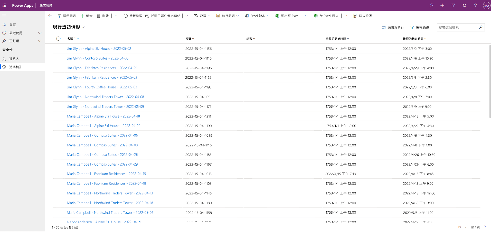

---
lab:
  title: 實驗室 3：如何建置模型導向應用程式
  module: 'Module 3: Get started with Power Apps'
---

# 實驗室 3：如何建置模型導向應用程式

**WWL 租用戶 - 使用條款**如果您針對講師導向訓練交付的一部分取得租用戶，請注意，租用戶的功能是為了在講師導向訓練中支援實際操作實驗室。 租用戶不應共用，或用於實際操作實驗室以外的用途。 本課程中使用的租用戶是試用租用戶，無法在課程結束後使用，且不符合擴充資格。 租用戶不得轉換成付費訂用帳戶。 此課程中提供的租用戶仍是 Microsoft Corporation 的財產，我們保留隨時取得存取權和重新持有的權利。 

## 案例

Bellows College 是一個教育組織，校園內有多棟大樓。 校園訪客目前記錄在紙本日誌中。 此資訊並未以一致的方式擷取，而且也無法收集和分析整個校園造訪的相關資料。

校園行政單位想要更新其訪客登記系統，讓保全人員控管各棟大樓的出入狀況，且所有造訪都必須由大樓負責人預先登記和記錄。

在整個課程中，您將建立應用程式並執行自動化功能，以便 Bellows College 的行政和保全人員能夠管理及控管校內大樓的出入狀況。

在此實驗室中，您將建立 Power Apps 模型導向應用程式，讓校園的後勤職員能夠管理整個校園的造訪記錄。

## 高階實驗室步驟

在建立模型驅動應用程式時，您將完成下列作業：

- 建立名稱為 Bellows Campus Management 的新模型導向應用程式

- 編輯應用程式導覽以參考必要的資料表

- 自訂應用程式所需資料表的表單和檢視

我們將使用下列元件：

- **檢視：** 檢視可讓使用者在表單資料表中顯示現有的資料。

- **表單**：這是使用者在資料表中建立/更新新資料列的位置。

這兩者都會整合至模型驅動應用程式，以提供更好的使用者體驗。

## 必要條件

- 完成**單元 0 實驗室 0：驗證實驗室環境**

- 完成**課程模組 2 實驗室 1 - 資料模型化**

開始前要考慮的事項

- 我們應該進行哪些變更來改善使用者體驗？

- 我們應該根據我們建置的資料模型，在模型驅動應用程式中納入哪些項目？

- 模型驅動應用程式的網站地圖上可以進行哪些自訂？

## 練習 1：自訂檢視和表單

**目標：** 此練習中，您將自訂將在模型驅動應用程式中使用的自訂已建立資料表的檢視和表單。

### 工作 #1：編輯造訪表單

1.  如果您尚未登入，請登入 `https://make.powerapps.com` 

2.  **如果尚未選取，請選取右上方的 Dev One** 環境。

3.  使用左側導覽，展開 Dataverse，選取 [資料表]****，然後按一下以開啟您的 [造訪]**** 資料表。

    如果您沒看到 [造訪] 資料表，請確保您處在正確的環境中 (步驟 2)。

4.  在 [資料體驗]**** 區段下方選取 [表單]****，然後按一下以開啟具有 [主要]**** 表單類型的 [資訊]**** 表單。 (**重要事項：** 請務必選取表單類型為 [主要]**** 的表單。) 

    > **重要事項：** 由於所有表單的名稱皆預設為資訊，因此請務必確認您選取的表單具有 [主要] **** 表單類型，而不是其他類型。 依預設，表單具有兩個欄位：[名稱] 和 [擁有者]。

5.  在畫面右側的 [屬性]**** 面板上，選取 [顯示名稱]**** 欄位，並將其變更為 `Main Information`。

6.  在左側瀏覽窗格中選取 [資料表資料行]****，然後將資料行拖曳至表單或按一下資料行名稱，以在 [擁有者]**** 欄位的下方新增下列欄位：

    1. [訪客]****

    2. [預定開始時間]****

    3. [預定結束時間]****

    4. [實際開始時間]****

    5. [實際結束時間]****

7.  將 [程式碼] **** 資料行拖曳到表單標頭中。

    標頭是表單的右上方區域。 您可能需要摺疊畫面右側的 [屬性] 面板，才能看到表單上的欄位。

8.  仍選取 [代碼]**** 欄位時，在畫面右側 [屬性] 面板中勾選 [唯讀]**** 的核取方塊。

9.  選取 [擁有者]**** 欄位。 在 [屬性] 面板中，將 [標籤]**** 變更為 `Host`

10. 選取右上方的 [儲存並發佈]**** 按鈕，並等候儲存和發佈完成。

11. 如果編輯檢視在新的瀏覽器索引標籤或視窗中開啟，請予以關閉。 否則，請選取 **🡠 畫面左上方的 [返回** ]。 您現在應已返回 [造訪]**** 資料表 表單。

12. 使用左上方的階層連結 ([資料表] **** >  [造訪] **** >  [表單]****)。 選取 [造訪]****，以返回 [造訪]**** 資料表主畫面。 

### 工作 #2：編輯現行造訪檢視

在此工作中，我們將修改預設的 [現行造訪] 檢視，並為今天的造訪建立新的檢視。

1.  在 [資料體驗]**** 區段下方，選取 [檢視]****，然後按一下以開啟 [現行造訪]**** 檢視。

2.  按一下或拖放欄位，將下欄欄位新增至檢視：

    1. **程式碼**

    2. [訪客]****

    3. [預定開始時間]****

    4. [預定結束時間]****

3.  選取 [建立於]**** 資料行上的下拉式功能表，然後選取 [移除]****。 [建立於]**** 欄位現在會從檢視中移除。

4.  將個別資料行寬度調整為適合資料的大小。

5.  在 [排序依據... ] **** 下 在 [排序依據] 下，選取 X 以移除 [名稱]****，然後改為選取 [排程的開始時間]****。

6.  選取 [排程的開始時間]**** 以將排列順序變更為 [由新至舊]****。

7.  選取右上方的 [儲存並發佈]**** 按鈕，並等候發佈完成。

### 工作 #3：為今天的造訪建立新的檢視

接下來我們將複製檢視，並為今天的造訪建立新的檢視。

> **重要事項：** 請確定您未關閉 [現行造訪] 檢視，因為我們會利用其來建立新的今日造訪檢視。

1.  選取**另存新檔**。

2.  將 [名稱]**** 變更為 `Today’s Visits`，然後選取 [儲存]****。

3.  在 [屬性] 面板選取 [編輯篩選條件]****。

4.  選取 [+ 新增]****，選取 [新增資料列]****。

5.  選取 [預定開始時間]**** 欄位，然後將 [等於] ** **[今天]**** 變更為下拉式清單中的條件。

6.  選取 **…** [狀態]**** 列上的 [更多指令]****，然後按一下 [刪除]**** 以刪除該篩選條件。

7.  選取 [確定] **** 以儲存條件。 現在篩選的檢視僅會顯示 [預定開始時間] **** 為今天的記錄。

8.  將 [實際開始時間] **** 和 [實際結束時間] **** 欄位新增至檢視。

> **注意：** 由於我們不再依據檢視狀態進行篩選，因此將會取得今天的所有造訪，包括已完成的項目。 這些欄位將有助於區分已完成的造訪和進行中的造訪。

9.  選取右上方的 [儲存並發佈]**** 按鈕，並等候發佈完成。

## 練習 2：建立模型驅動應用程式

**目標：** 在此練習中，您將建立模型驅動應用程式、自訂網站地圖，以及測試應用程式。

為了簡單和節省時間起見，有部分 [造訪] 資料行不會在此實驗中處理。

### 工作 #1：建立應用程式

1.  如果您尚未登入，請登入 `https://make.powerapps.com` 

2.  **如果尚未選取，請選取右上方的 Dev One** 環境。

3.  選取位於左側瀏覽上的 [+ 建立]****。

4.  建立模型導向應用程式：

    1. 在 [建立您的應用程式]**** 畫面的 [起始]**** 區段中，選取 [空白應用程式]****。

    2. 在 [根據 Dataverse 的空白應用程式]**** 底下，選取 [建立]****。

    3. 針對 [名稱]**** 輸入 `Bellows Campus Management`，然後選取 [建立]****。

5.  載入新的模型驅動應用程式之後，選取 [+ 新增頁面]**** 按鈕。

6.  在 [新增頁面]**** 畫面上，選擇 [Dataverse 資料表]****，然後選取 [下一步]**** 按鈕。

7.  選取下列資料表：

    1. 造訪

    2. 連絡人

8.  在您擁有這兩個資料表之後，請選取 [新增]****。

9.  使用畫面左側的導覽圖示，選取 [導覽]****。

10. 在瀏覽窗格中，選取顯示瀏覽的 [新群組]****。 您可能需要展開左側的功能表。

11. 在畫面右側的 [顯示選項]**** 區段中，將 [標題]**** 屬性變更為 `Security`。

12. 選取 [儲存]****，然後等待變更儲存完畢。

13. [儲存]**** 完成後，請選取 [發佈]**** 按鈕以發佈變更。 等候發佈完成。

### 工作 #2：測試應用程式

啟動應用程式

1. 選取 [播放]**** 按鈕，模型驅動的應用程式將會載入新索引標籤。

建立新的連絡人。

2.  應用程式應開啟至 [我的現行連絡人]**** 檢視。 如果沒有，請選取 **左側導覽上的 [聯繫人** ]。

3.  從命令列選取 [+ 新的]****。

4.  在 [名字]**** 中輸入 `John`，而 [姓氏]**** 中輸入 `Doe`。

5.  以 [電子郵件]**** 的形式提供您的個人電子郵件。 這會在未來的實驗室中使用，您將在其中收到電子郵件。

6.  選取**儲存&amp;關閉**。

7.  您現在應該會在 [我的現行連絡人]**** 檢視中看到已建立的連絡人。

建立新的造訪

8.  從左側導覽 (又稱為網站地圖) 中選取 [造訪]****。

9.  選取 **+ 新增**。

10. 如下所示輸入至欄位：

    1. **名稱**：`New test visit`

    2. **訪客 ** ：選取** John Doe**

    3. **預定開始時間**：選取明天的日期和下午 2:00 做為開始時間

    4. **預定結束時間**：選取明天的日期和下午 3:30 做為結束時間

11. 選取**儲存&amp;關閉**。 這會建立造訪，而且應會顯示在 [現行造訪] **** 檢視中

12. 使用 [現行造訪]**** 旁的下拉式清單將檢視變更為 [今天的造訪]****。 您不應該再看到檢視中的新造訪，因為已排定於明天。

13. 您可以新增更多測試記錄。

執行中的模型驅動應用程式看起來應該大致如下：

恭喜！ 您已建立並設定第一個模型驅動的應用程式。

## 挑戰

- 選取 [連絡人] 的特定檢視和表單。

