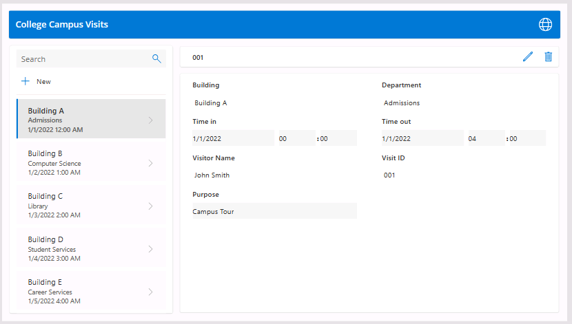

---
lab:
  title: Bonus Lab：使用 Copilot 建置畫布應用程式
  module: 'Module 3: Get started with Power Apps'
---

# Bonus Lab：使用 Copilot 建置畫布應用程式

**WWL 租用戶 - 使用條款**如果您針對講師導向訓練交付的一部分取得租用戶，請注意，租用戶的功能是為了在講師導向訓練中支援實際操作實驗室。 租用戶不應共用，或用於實際操作實驗室以外的用途。 本課程中使用的租用戶是試用租使用者，在課程結束后無法使用或存取租使用者，且不符合延伸模塊的資格。 租用戶不得轉換成付費訂用帳戶。 此課程中提供的租用戶仍是 Microsoft Corporation 的財產，我們保留隨時取得存取權和重新持有的權利。 

## 案例

Bellows College 是一個教育組織，校園內有多棟大樓。 校園訪客目前記錄在紙本日誌中。 此資訊並未以一致的方式擷取，而且也無法收集和分析整個校園造訪的相關資料。

校園行政單位想要更新其訪客登記系統，讓保全人員控管各棟大樓的出入狀況，且所有造訪都必須由大樓負責人預先登記和記錄。

在此實驗室中，您將使用 Copilot 建立新的畫布應用程式來記錄造訪。 

## 高階實驗室步驟

我們將遵循以下大綱來設計畫布應用程式：

- 描述您要建置的應用程式

- 使用 Copilot 修改支援的數據表結構

 ## 必要條件

- 課程模組 1 實驗室 0 完成 **- 驗證實驗室環境**

## 練習 1：使用 Copilot 建立大學訪問申請。

**目標：** 在此練習中，您會連線到 Expense Reports 數據表來建立畫布應用程式。

### 工作 \#1：建立初始應用程式

1. 導覽到 https://make.powerapps.com

2. 您可能需要重新驗證 - 視需要選取 **[登入** ]，並遵循指示。

3. **如果尚未選取，請選取右上方的 Dev One** 環境。

4. 在 [ **描述您要建立** 的應用程式] 方塊中，輸入下列文字。 建立記錄到大學校園之造訪的應用程式。 

5. 選取 [執行]**** 按鈕。

Copilot 會開始建置數據表結構以支援您的應用程式。 

> **重要：** 使用產生式 AI 時，您不一定會得到相同的確切結果。 您的數據表可能無法完全符合為另一名學生建立的數據表。 

6. 在 [ **描述要變更** 的內容] 方塊中，輸入文字：新增兩個數據行：[時間] 和 [逾時]。兩者都應該是日期和時間欄位。  

7. 選取 [ **移至]** 按鈕或按 **Enter** 鍵。 

8. 捲動至數據表的一側，並確認已建立 [時間]** 和 **[** 逾**時] 數據行。 

由於我們正在記錄訪客進出時間，因此不再需要任何其他流覽日期欄位。 

9. 找出 [**瀏覽日期]** 欄位 （或對等欄位），然後在 [描述要變更的專案] 方**塊中**，輸入 [移除瀏覽日期字段] 文字。 

10. 選取 [執行]**** 按鈕。 

11. 移除 [時間]** 和 **[逾**時] 以外的**任何其他日期欄位。 

一開始，已新增一個 **字段，例如目的** 欄位，其格式為文字數據類型。 我們將讓 Copilot 將其變更為下拉功能表 （選擇） 選單。 

12. 在 [ **描述要變更的專案] 方塊中，** 輸入下列文字：將 [目的] 字段變更為具有下列選項的選擇功能表：[校園導覽]、[職業博覽會]、[與教授會面]、[學生輔導]、[其他]。 

13. 選取 [執行]**** 按鈕。 

14. 由於我們也想要擷取建置編號，請在 [描述要變更的專案] 方塊**中**輸入：新增建置數據行。 

15. 選取 [執行]**** 按鈕。 

16. 一旦您滿意您的資料表，請選取 [ **建立應用程式** ] 按鈕。 

17. 如有必要，在 [ **歡迎使用 Power Apps Studio** ] 畫面上，選取 **[不要再次**顯示我]，然後選取 [ **略過** ] 按鈕。 

恭喜，您已使用 Copilot 建立新的應用程式。 
