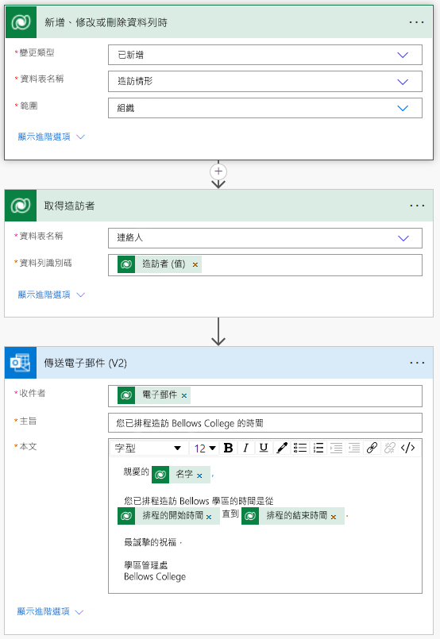

---
lab:
  title: 實驗室 4:如何建立自動化解決方案
  module: 'Module 4: Get Started with Power Automate'
ms.openlocfilehash: 35d4b6940f31e1a2aef5e8b43d8ca7007e1b72f2
ms.sourcegitcommit: 8a89b7eacd1a65eaa7c5d6bff0dc7254991c4dde
ms.translationtype: HT
ms.contentlocale: zh-TW
ms.lasthandoff: 07/15/2022
ms.locfileid: "147154320"
---
# 實驗室 4:如何建立自動化解決方案

## 案例

Bellows College 是一個教育組織，校園內有多棟大樓。 校園訪客目前記錄在紙本日誌中。 此資訊並未以一致的方式擷取，而且也無法收集和分析整個校園造訪情形的相關資料。

校園行政單位想要更新其訪客登記系統，讓保全人員控管各棟大樓的出入狀況，且所有造訪情形都必須由大樓負責人預先登記和記錄。

在整個課程中，您將建立應用程式並執行自動化功能，以便 Bellows College 的行政和保全人員能夠管理及控管校內大樓的出入狀況。

在此實驗室中，您將建立 Power Automate 流程，在排程造訪時傳送電子郵件給訪客。

## 高階實驗室步驟

您必須實作下列需求才能完成專案：

- 排程造訪時，必須透過電子郵件通知連絡人。

## 必要條件

- 完成 **單元 0 實驗室 0：驗證實驗室環境**
- 完成 **課程模組 2 實驗室 1 - 資料模型化**
- 完成 **課程模組 2 實驗室 3 完成 - 如何建置模型驅動應用程式**
- 已建立填入個人電子郵件地址的連絡人 John Doe

## 練習 1：建立造訪通知流程

**目標：** 在此練習中，您將建立可實作需求的 Power Automate 流程。 造訪建立時，訪客應該會收到一封電子郵件，其中含有針對造訪情形指派的唯一代碼。

### 工作 \#1：建立流程

1.  瀏覽至 <https://make.powerapps.com>。 您可能需要重新驗證：如有需要，請按一下 **[登入]** ，然後依照指示操作。

2.  如果尚未選取，請在右上方選取您的 [[我的縮寫名] 練習] 環境。

3.  在左側導覽中，選取 [流程]。

4.  如果出現提示，請選取 [開始]。

5.  按一下 [新增流程]，然後選取 [自動化雲端流程]。

6.  在 [流程名稱] 中輸入 "Visit Notification"。

7.  在 [選擇流程的觸發程序] 中，搜尋 **Dataverse**。

8.  選取觸發程序 [When a row is added, modified or deleted] (當有資料列新增、修改或刪除時)，然後按一下 [建立]。

9.  填入流程的觸發條件：

    1.  為 [變更類型] 選取 [已新增]

    2.  選取 **[造訪情形]** 做為 **[資料表名稱]**

    3.  選取 **[組織]** 做為 **[範圍]**

    4.  按一下觸發程序步驟上的省略符號 ( [...])，然後按一下 [重新命名]。 將此觸發程序重新命名為 **"When a visit is added"** 。 這是個很好的練習，讓您和其他流程編輯者均可瞭解步驟的目的，而不必深入探討細節。

### 工作 \#2：建立用以取得訪客資料列的步驟

1.  選取 [+ 新步驟] 。 此為擷取訪客資訊 (包括電子郵件地址) 的必要步驟。

2.  搜尋 **Dataverse**。

3.  選取 [依識別碼取得資料列] 動作。

4.  選取 **[連絡人]** 做為 **[資料表名稱]**

5.  選取 [資料列識別碼] 欄位。 請注意，會出現視窗提示您選取 Dynamic 內容或運算式。

6.  在 **[資料列識別碼]** 欄位中，從 [動態內容清單] 中選取 **[訪客 (值)]** 。 在此步驟中，您會尋找 [造訪情形] 資料列的連絡人，其建立用途是觸發此流程。 因為電子郵件地址是 [連絡人] 資料表的一部份，所以您需要此資訊以將電子郵件傳送給訪客。

7.  按一下此動作上的省略符號 ([...])，然後按一下 [重新命名]。
        將此動作重新命名為 **「取得訪客」** 。 這是個很好的練習，讓您和其他流程編輯者均可瞭解步驟的目的，而不必深入探討細節。

### 工作 \#3：建立用以將電子郵件傳送給訪客的步驟

1.  按一下 [+ 新增步驟]。 這是會將電子郵件傳送給訪客的步驟。

2.  搜尋 *郵件*，再依序選取 [Office 365 Outlook]連接器及 [傳送電子郵件 (V2)] 動作。

3.  如果系統要求您接受使用此動作的條款及條件，請按一下 [接受]。

4.  選取 [收件人] 欄位底下的 [新增動態內容]。 
    
5.  從動態內容清單中選取 [電子郵件]。
        > Notice that it is beneath the **Get the visitor** header. This means you
        are selecting the Email that is related to the Visitor that you looked
        up in the previous step.

6.  在 **[主旨]** 欄位中輸入 **您的 Bellows College 預定造訪行程**。

7.  在 **[電子郵件本文]** 中輸入下列文字：

>   名稱括以括號的欄位，必須置入動態內容。 建議您先複製並貼上所有文字，然後再於正確的位置中新增動態內容。

~~~~~~~~~~~~~~~~~~~~~~~~~~~~~~~~~~~~~~~~~~~~~~~~~~~~~~~~~~~~~~~~~~~~~~~~~~~~~~~~
   Dear {First Name},

   You are currently scheduled to visit Bellows Campus from {Scheduled Start} until {Scheduled End}.

   Best regards,

   Campus Administration
   Bellows College
~~~~~~~~~~~~~~~~~~~~~~~~~~~~~~~~~~~~~~~~~~~~~~~~~~~~~~~~~~~~~~~~~~~~~~~~~~~~~~~~

8.  醒目提示 **{First Name}** 文字。 將其取代為 [取得訪客] 步驟中的 [名字] 欄位。

9.  醒目提示 **{Scheduled Start}** 文字。 將其取代為 [當造訪新增時] 步驟中的 [排定開始時間] 欄位。

10.  醒目提示 **{Scheduled End}** 文字。 將其取代為 [當造訪新增時] 步驟中的 [排定結束時間] 欄位。

11.  按一下 [儲存]。

保持此流程索引標籤處於開啟狀態，以供下一個工作使用。 您的流程看起來應近似於下圖：

### 工作 4\#：驗證並測試流程

1.  在瀏覽器中開啟新的索引標籤，並巡覽至 <https://make.powerapps.com>。

2.  如果尚未選取，請在右上方選取您的 [[我的縮寫名] 練習] 環境。

3.  按一下 [應用程式]，然後選取您先前建立的 [Bellows 校園管理] 模型驅動應用程式。

3.  保持此瀏覽器索引標籤處於開啟狀態，然後導覽回之前的流程索引標籤。

4.  在命令列上按一下 **[測試]** 。 選取 [手動] 然後按一下 [測試]。

5.  保持模型驅動應用程式開啟，並巡覽至瀏覽器索引標籤。 

6.  使用左側的導覽，選取 [造訪]。

6. 按 [+ 新增] 按鈕以新增 [造訪] 記錄。

7. 完成造訪記錄，如下所示：

    -   **名稱：** 測試造訪

    -   **訪客：** John Doe

    -   **排定開始時間：** 明天上午 8:00

    -   **排定結束時間：** 明天上午 9:00

8. 選取 **儲存後關閉** 按鈕。

9. 保持流程測試執行，並巡覽至瀏覽器索引標籤。 短暫延遲之後，您應該會看到流程正在執行。 您可以在其中攔截任何流程中的問題，或確認流程已成功執行。

短暫延遲之後，您應會在收件匣中看到一封電子郵件，因為您已填入 John Doe 的電子郵件作為您的個人電子郵件。 請注意，它可能會移至您的垃圾郵件資料夾。

## 挑戰

- 在電子郵件上進行格式設定。 如何讓其具有更專業的外觀？