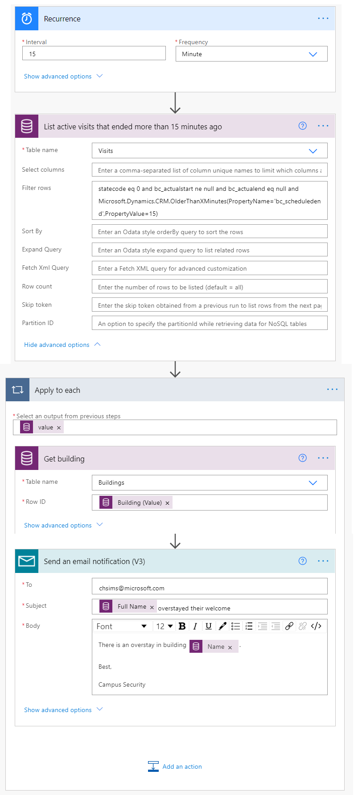

---
lab:
    title: '實驗室 6：如何建立自動化解決方案'
    module: '單元 4：Power Automate 入門'
---

# 單元 4：Power Automate 入門
## 實驗室：如何建立自動化解決方案

## 案例

Bellows College 是一個教育組織，校園內有多棟大樓。校園訪客目前記錄在紙本日誌中。此資訊並未以一致的方式擷取，而且也無法收集和分析整個校園造訪情形的相關資料。 

校園行政單位想要更新其訪客登記系統，讓保全人員控管各棟大樓的出入狀況，且所有造訪情形都必須由大樓負責人預先登記和記錄。

在整個課程中，您將建立應用程式並執行自動化功能，以便 Bellows College 的行政和保全人員能夠管理及控管校內大樓的出入狀況。 

在本實驗室中，您將建立 Power Automate 流程以自動化校園管理的各種環節。 

# 高階實驗室步驟

您必須實作下列需求才能完成專案：

* 在訪客造訪之前，必須向每位訪客提供指派給他們的唯一代碼。
* 保全人員必須收到訪客停留時間超過其預定時段的通知。

## 先決條件

* 完成**單元 0 實驗室 0：驗證實驗室環境**
* 完成**單元 2 實驗室 1：Microsoft Dataverse 簡介**
* 在**單元 3 實驗室 2：如何建立畫布應用程式 (第 2 部分)** 中建立的「校園教職員」應用程式 (用於測試)
* 在**單元 3 實驗室 4：如何建立單元導向應用程式**中使用個人電子郵件地址建立的「John Doe」連絡人 (用於測試)

## 開始前要考慮的事項

-   什麼是最適當的訪客代碼發佈機制？
-   您可以如何衡量停留逾時情形並強制執行嚴格的原則？

# 練習 1：建立「造訪情形通知」流程

**目標：** 在此練習中，您將建立可實作需求的 Power Automate 流程。訪客應該會收到一封電子郵件，其中含有針對造訪情形指派的唯一代碼。

## 工作 1：建立流程

1.  開啟您的 [校園管理] 解決方案

    -   登入 <https://make.powerapps.com>

    -   選取您的**環境**。

    -   選取 **[解決方案]**。

    -   按一下以開啟**校園管理**解決方案。

2.  按一下 **[新增]** 並選取 **[自動化]**、**[雲端流程]**，然後選擇 **[自動化]**。此動作會在新視窗中開啟 Power Automate 流程編輯器。

3. 在 **[選擇流程的觸發程序]** 中，選取 **[Microsoft Dataverse]**。

4. 選取觸發程序 **[新增、修改或删除列時]**，然後按一下 **[建立]**。

   * 選取 **[已新增]** 做為 **[變更類型]**
   
   * 選取 **[造訪情形]** 做為 **[資料表名稱]**
   
   * 選取 **[組織]** 做為 **[範圍]**
   
   * 按一下觸發程序步驟上的省略符號 (**...**)，然後按一下 **[重新命名]**。將此觸發程序重新命名為 **「新增造訪情形時」**。這是個很好的練習，讓您和其他流程編輯者均可瞭解步驟的目的，而不必深入探討細節。

5. 選取 **[新的步驟]**。此為擷取訪客資訊 (包括電子郵件地址) 的必要步驟。

6. 搜尋 **[Microsoft Dataverse]**。

7. 選取 **[依識別碼取得資料列]** 動作。 

   * 選取 **[連絡人]** 做為 **[資料表名稱]**
   
   * 在 **[資料列識別碼]** 欄位中，從 [動態內容清單] 中選取 **[訪客 (值)]**。
   
   * 按一下此動作的省略符號 (**...**)，然後按一下 **[重新命名]**。將此動作重新命名為 **「取得訪客」**。這是個很好的練習，讓您和其他流程編輯者均可瞭解步驟的目的，而不必深入探討細節。

8. 按一下 **[新增步驟]**。此步驟可建立電子郵件並將其傳送給訪客。

9. 搜尋 *[郵件]*，然後選取 **[Office 365 Outlook]** 連接器和 **[傳送電子郵件 (V2)]** 動作。

   * 如果系統要求您接受使用此動作的條款及條件，請按一下 **[接受]**。
   
   * 選取 **[收件人]** 欄位，然後從 [動態內容清單] 中選取 **[電子郵件]**。請注意，此項目位於 **[取得訪客]** 標題下方。這表示您要選取與您在上一個步驟中查詢的「訪客」相關的「電子郵件」。 

   * 在 **[主旨]** 欄位中輸入**您的 Bellows College 預定造訪行程**。

   * 在 **[電子郵件本文]** 中輸入下列文字：  
        
        > 動態內容必須置於括弧中已具名欄位的位置。建議您先複製並貼上所有文字，然後再於正確的位置中新增動態內容。
   
        ```
        Dear {First Name},

        You are currently scheduled to visit Bellows Campus from {Scheduled Start} until {Scheduled End}.

        Your security code is {Code}, please do not share it. You will be required to produce this code during your visit.

        Best regards,

        Campus Administration
        Bellows College
        ```
   
10.  選取上方 **[未命名]** 的流程名稱，然後將其重新命名為`Visit notification`

11. 按下 **[儲存]**

    保持此流程索引標籤處於開啟狀態，以供下一個工作使用。您的流程看起來應近似於下圖：


## 工作 2：驗證並測試流程

1.  在瀏覽器中開啟新的索引標籤，然後導覽至 <https://make.powerapps.com>

2.  按一下 **[應用程式]**，然後選取您建立的 **[校園教職員]** 應用程式

3.  保持此索引標籤處於開啟狀態，然後導覽回之前的流程索引標籤。 

4.  在命令列上按一下 **[測試]**。選取 **[手動]**，然後選取 **[儲存並測試]**。

5.  保持流程索引標籤處於開啟狀態，然後導覽回之前的 **[校園教職員]** 應用程式索引標籤。

6.  按下 **[+]** 以新增造訪情形記錄

7.  輸入 **John Doe** 做為 **[名稱]**，然後選擇任一 **[大樓]**

8.  選擇 **[John Doe]** 做為 **[訪客]**

9.  將 **[預定開始時間]** 和 **[預定結束時間]** 選擇為未來的任何日期。

10.  按下 **[核取記號]** 圖示以儲存新的造訪情形

11.  導覽回之前含有測試中流程的索引標籤。觀察流程執行狀況。如果出現任何錯誤，請返回並比較您的流程與上述範例。如果電子郵件傳送成功，您會在收件匣中收到該郵件。 

12.  按一下命令列上的 [上一步箭頭]

13.  在 **[詳細資料]** 區段中，請注意 **[狀態]** 已設定為 **[開啟]**。這表示每當建立新的造訪情形時，您的流程將會執行，直到您將其關閉為止。每當流程執行時，您將會看到其新增至 **[28 天執行歷程記錄]** 清單中。

14.  在命令列上按一下 **[關閉]** 以關閉流程。您可能需要按下省略符號 (**...**) 才能看到此選項。

15.  關閉此視窗。

# 練習 2：建立「安全掃描」流程

**目標：** 在此練習中，您將建立可實作需求的 Power Automate 流程。每 15 分鐘就必須執行安全掃描，且如果有任何訪客的停留時間超過其預定時間，則應該通知保全單位。

## 工作 1：建立流程以擷取記錄

1. 開啟您的 [校園管理] 解決方案

   -   登入 <https://make.powerapps.com>

   -   選取您的**環境**。

   -   選取 **[解決方案]**。

   -   按一下以開啟**校園管理**解決方案。

2. 按一下 **[新增]** 並選取 **[自動化]**、**[雲端流程]**，然後選擇 **[預定]**。此動作會在新視窗中開啟 Power Automate 流程編輯器。

3. 將流程設定為每 **15** 分鐘重複一次。

4. 按一下 [**建立**]。

5. 按一下 **[新增步驟]**。選取 *[目前]*，然後選取 **[Microsoft Dataverse]** 連接器。選取 **[列出資料列]** 動作。

   * 輸入 **[造訪情形]** 做為 **[資料表名稱]**
   
   * 按一下 **[顯示進階選項]**

   * 輸入下列運算式做為 **[篩選條件資料列]**

   ```
     statecode eq 0 and bc_actualstart ne null and bc_actualend eq null and Microsoft.Dynamics.CRM.OlderThanXMinutes(PropertyName='bc_scheduledend',PropertyValue=15)
   ```
   
   * 拆解運算式：
       * **statecode eq 0** 會篩選現行造訪情形 (狀態等於現行)
       * **bc_actualstart ne null** 會將搜尋限制為「實際開始時間」含有值 (即有簽入情況) 的造訪情形
       * **bc_actualend eq null** 會將搜尋限制為沒有簽出情況 (「實際結束時間」沒有值) 的造訪情形 
       * **Microsoft.Dynamics.CRM.OlderThanXMinutes(PropertyName='bc_scheduledend',PropertyValue=15)** 會將造訪情形限制為應該在 15 分鐘前完成的造訪情形。

   * 按一下此動作的省略符號 (**...**)，然後按一下 **[重新命名]**。將此動作重新命名為 **「列出在 15 分鐘前已結束的現行造訪情形」** 這是個很好的練習，讓您和其他流程編輯者均可瞭解步驟的目的，而不必深入探討細節。

6.  按一下 **[新增步驟]**。搜尋 *「套用」*，選取 **[套用至每個項目]** 動作 

7.  在 **[從先前的步驟中選取輸出]** 欄位中，從動態內容中選取 **[值]**。請注意，此項目位於 **[列出在 15 分鐘前已結束的現行造訪情形]** 灰色標題下方。這表示您要選取您在上一個步驟中查詢的造訪情形清單。 

8.  擷取「大樓」資料以取得相關記錄

    * 在 [套用至每個項目] 迴圈中按一下 **[新增動作]**。
    
    * 選取 **Microsoft Dataverse**。 
    
    * 選取 **[依識別碼取得資料列]** 動作。
    
    * 選取 **[大樓]** 做為 **[資料表名稱]**
    
    * 從動態內容中選取 **[大樓 (值)]** 做為 **[資料列識別碼]**
    
    * 按一下 **[取得記錄]** 旁邊的 **[...]**，然後選取 **[重新命名]**。輸入**取得大樓**做為步驟名稱
    
9.  擷取「訪客」資料以取得相關記錄

    * 在 [套用至每個項目] 迴圈中按一下 **[新增動作]**。
    
    * 選取 **Microsoft Dataverse**。
    
    * 選取 **[依識別碼取得資料列]** 動作。
    
    * 選取 **[連絡人]** 做為 **[資料表名稱]**
    
    * 從動態內容中選取 **[訪客 (值)]** 做為 **[資料列識別碼]**
    
    * 按一下 **[取得記錄]** 旁邊的 **[...]**，然後選取 **[重新命名]**。輸入**取得訪客**做為步驟名稱
    
10.  傳送電子郵件通知

     * 在 [套用至每個項目] 迴圈中按一下 **[新增動作]**。從 **[Office 365 Outlook]** 連線中新增 **[傳送電子郵件 (V2)]**。

11.  輸入您的電子郵件地址做為 **[收件人]**

12.  在 **[主旨]** 欄位中輸入下列內容。**[全名]** 為**取得訪客**步驟中的動態內容。

   ```
   {Full Name} overstayed their welcome
   ```
   
13.  在 **[本文]** 欄位中輸入下列內容。**[名稱]** 為**取得大樓**步驟中的動態內容。您可能需要滾動到清單的底部。

   ```
   There is an overstay in building {Name}.
         
   Best,
         
   Campus Security
   ```

14.  選取左上角的流程名稱 **[未命名]**，然後將其重新命名為**安全掃描**

15.  按下 **[儲存]**

    您的流程看起來應近似於下圖：



## 工作 2：驗證並測試流程

如果有符合流程中列出之需求的造訪情形，您的流程將會開始傳送電子郵件給您 (傳送至您先前建立 John Doe 連絡人時指定的電子郵件地址)。

1. 驗證您是否有符合下列條件的造訪情形記錄：

   1. 具有現行狀態
   
   2. 預定結束時間為過去時間 (超過 15 分鐘)
   
   3. 實際開始時間含有值。
   
   > **注意**：若要檢視此資料，請在新的索引標籤中導覽至 make.powerapps.com。在左側窗格上，按一下 [解決方案] 以找到您的解決方案。選取 [造訪情形] 實體，然後選取 [資料] 索引標籤。在右上角按一下 [現行造訪情形] 以顯示檢視選取器，然後選取「全部」欄位。
   
2. 如果您尚未導覽至 **[安全掃描]** 流程，請導覽至該位置。

3. 當流程開啟時，請按一下 **[測試]**。

4. 選取 **[手動]**。

5. 按一下 **[儲存並測試]** 和 **[執行流程]**。

6. 當流程完成時，請按一下 **[完成]**。 

7. 展開 **[套用至每個項目]**，然後展開 **[傳送電子郵件通知]** 步驟。檢查 **[主旨]**、**[電子郵件本文]** 值。

8. 選取上一步箭頭以查看 [安全掃描] 流程詳細資料。在命令列上選取 **[關閉]**。這是為了防止流程在測試系統上依排程執行。

# 挑戰

* 將 [實際開始時間] 和 [預定結束時間] 新增至電子郵件本文。
* 您可以如何確保電子郵件本文中使用簡單易用的日期格式？
* 是否能夠產生含有停留逾時資訊的資料表，並且僅傳送單一電子郵件？
* 您是否可以產生造訪情形代碼的條碼？該條碼什麼時候會派上用場？
